# HoneybadgerBFT

## 面临问题

现有的共识算法大多是**同步/半同步网络**下的共识算法，而现实的网络环境又会出现完全异步的情况。大多数共识算法都会在该情况下失效，故需要一种**异步网络**假设（也就是对网络没有假设）情况下的共识算法来解决这个问题。HoneyBadgerBFT就是一个这样的算法，其吞吐量和延迟性能在异步网络情况下要比PBFT都要好。而异步共识的设计就绕不开FLP不可能定理。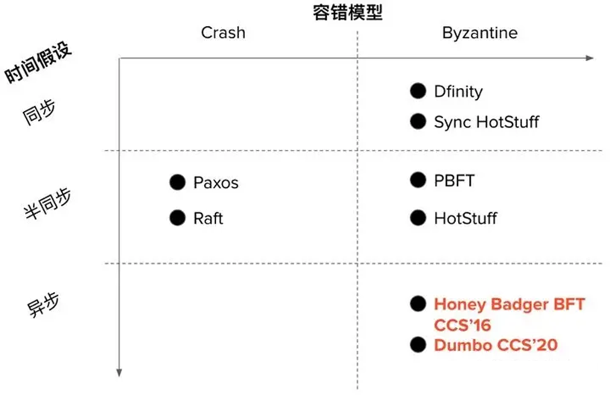

### FLP不可能定理

纯异步的环境下不可能存在一种**确定性**的共识协议。这对之后的研究带来了两方面的妥协：要么加强**网络假设**、要么引入**随机源**[^1]。

经典的PBFT共识就是**对网络假设妥协**，假设了半同步网络的存在，故而当网络恢复到同步之后，总能选出一个诚实的leader，进而保证协议的活性。但对应的缺点也很明显：异步环境下的无休止view change、timer对性能的影响等。

本文的方案就是采用后者引入了随机源，当协议无法达成共识时就借助抛筛子的方式**随机**选取一个结果作为最终结果。

## 解决方案HBBFT

### 概述

HBBFT通过模块化的方式，解决了拜占庭环境下的**原子广播（ABC）问题**，这是共识的**等价问题**。该问题可以描述为：如何保证在异步和拜占庭的环境下，各节点按照相同的顺序收到相同的消息。实现过程如下图所示：

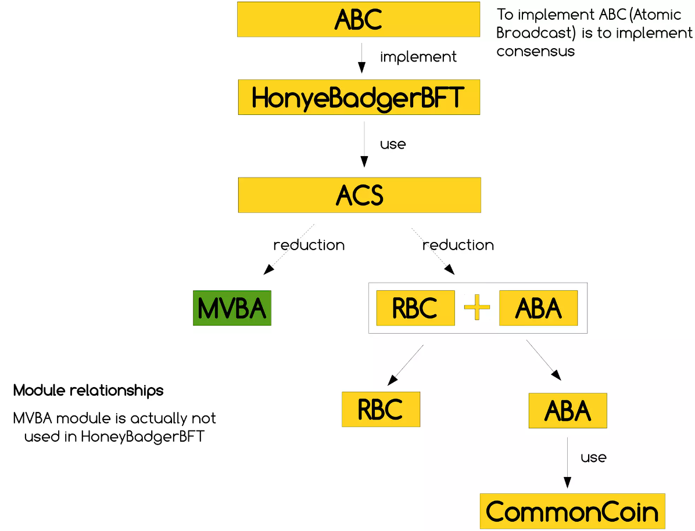

而各模块之间的关系可以表示为，各模块会在之后章节逐一介绍：

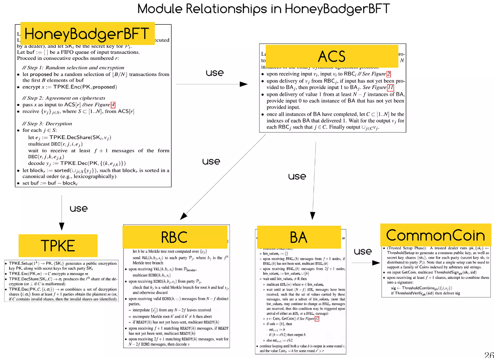

简单理解，HBBFT算法总体步骤大致可分为三步，重点则是第二步：

1. 初始化、随机选取交易集并对交易集加密。
2. $\textcolor{red}{ACS实现交易的可靠广播（RBC实现）和共识（ABA实现）}$。
3. 解密、生成块等其他操作。

### HBBFT算法流程

根据下图论文中的描述，算法细节可以认为有三部分：

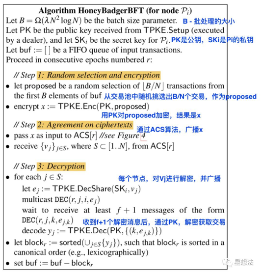

1. 节点 Pi 先根据随机选择交易块的选择规则选取要进行共识的交易集合（**B/N**个交易）`每个节点选取的是交易子集，这个选法非常适合批处理`，第三方可信机构分发私钥分片给每个节点。节点 Pi 使用公钥PK对交易集进行加密，加密的交易用 x 表示。

2. 将 x 作为ACS的输入，ACS结束后，会收到N个（包括自己的那一个，其余为其他节点发起的交易共识）交易集 vj ，以及交易对应的**01比特串**，其中的每个比特对应一个节点发起的共识交易集合是否被提交（1表示该交易集最终会被提交，0表示该交易集不会被提交）。

3. 将二进制共识结果为 1 的交易块收集起来，并对它进行解密，当 Pi 收到 **f + 1**个解密分片的时候 Pi 就可以解密得到 vj 的明文交易集合。交易被解密之后，会进行赛重、校验交易正确性、和排序等环节。交易被提交之后，就会从待提交的交易缓冲池中删除。

HBBFT的过程形象化如下图所示，其中ACS便是该算法的精华部分：每个节点都参与贡献一个区块的一部分，而
ACS 的作用就是$\textcolor{red}{决定哪些节点贡献的这一部分最终达成了共识}$。

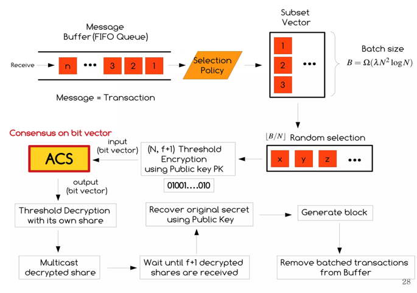

## TPKE阈值加密

TPKE是HBBFT中的阈值加密模块，通过TPKE加密的数据，需要**多份子密钥**才能解密。

为什么要使用TPKE方案呢？因为在异步网络下，对手可以$\textcolor{red}{选择性地延迟特定节点的提议}​$，而TPKE则可以让对手不知道是哪个节点提出的提议，实现**审查弹性**。

## ACS异步公共子集算法

HBBFT中的第二步通过了ACS实现广播交易消息x和确定共识的功能，那么ACS具体是怎么实现的呢？

ACS的过程可以概括为：$\textcolor{red}{每个节点通过RBC协议广播提议，之后使用ABA决定一个关于RBC提议值的向量，这个向量就是一致的交易列表}​$。

具体来说，论文里给出了如下描述：

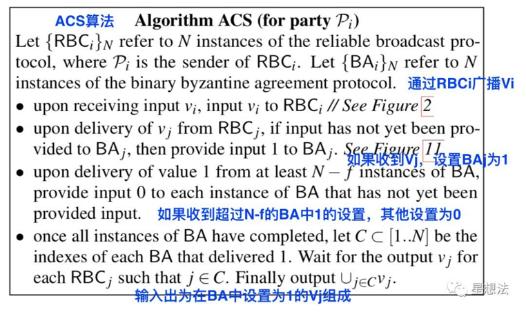

每个节点P各自维护着自己的RBC实例和ABA实例，对于每个节点来说，相同的过程为：

- 在收到输入Vi后通过RBCi广播Vi消息；
- 在收到RBCj的广播消息后，就将对应的BAj设为1；
- 收到超过**N-f**个BA组播的1后，将其他BA设置为0；
- 输出在BA中设置为1的vj。

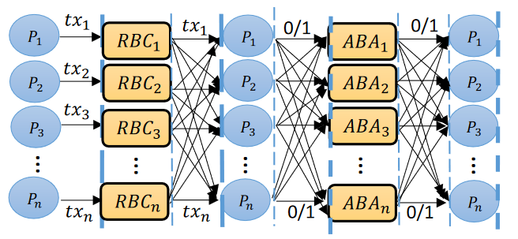

## RBC可靠广播算法

相较于PBFT的广播，HBBFT中的RBC中实现了很多优化。

### 纠删码优化

PBFT中的Leader的带宽有限，成为了系统瓶颈。RBC通过将需要传递的消息v**拆分**为n个小块，分别发送给不同节点，再**相互广播**，就可以共同组成原消息。Leader的上行带宽消耗是所有小块数据量之和，是传统PBFT的**1/n**。本质上是$\textcolor{red}{利用所有节点的带宽来平衡了Leader的带宽消耗}​$。

分小块优化后速度是快了，但可能出现恶意节点不转发自己块的情况。为了防止恶意节点故意不发出自己的部分小块，采用**纠删码**解决这个问题。如下图所示，$\textcolor{red}{纠删码可以在原消息拆分成N块后，通过N-2f块还原出原信息}​$：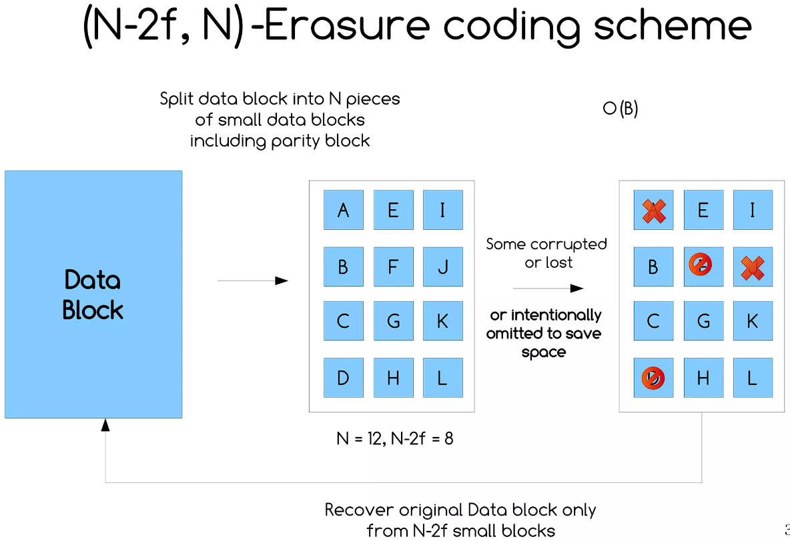

### 算法细节

论文中对RBC算法有如下描述：

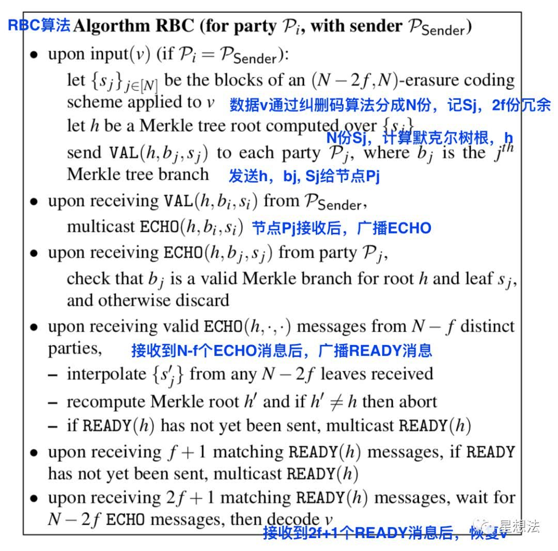

其中的纠删码编码的信息块所组成的**Merkle Tree**为：

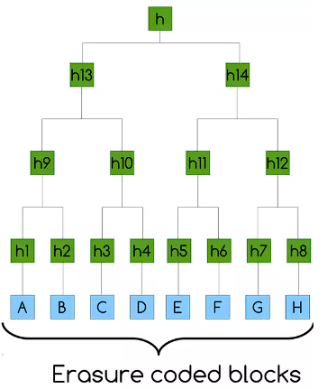

整个过程也可简单概括为：$\textcolor{red}{RBC通过Echo、Ready两轮广播后，消息v被所有节点成功接收}$。

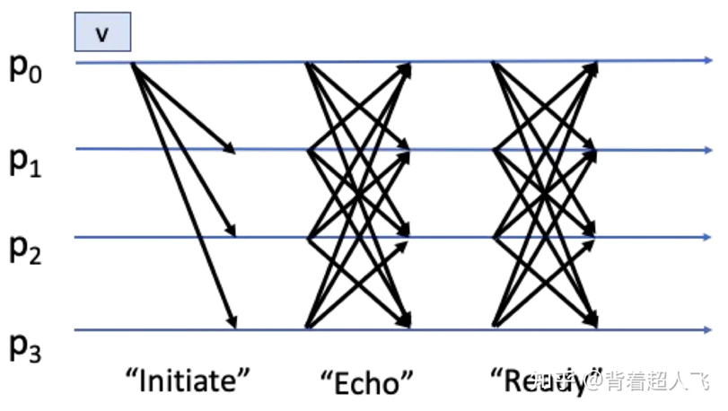

## BA二元共识算法

（异步）二元共识算法用于对RBC实例中的值进行**共识**。实现原理就是当节点无法达成一致的时候借助一个外部随机源做决定。

节点之间选出一个结果，然后还需要$\textcolor{red}{抛硬币（随机数）来决定结果是否被采纳}$。相同就采纳，不相同就不采纳。本文已经证明了在**常数轮次**可以达成最终的共识。

论文中对BA算法的描述为：

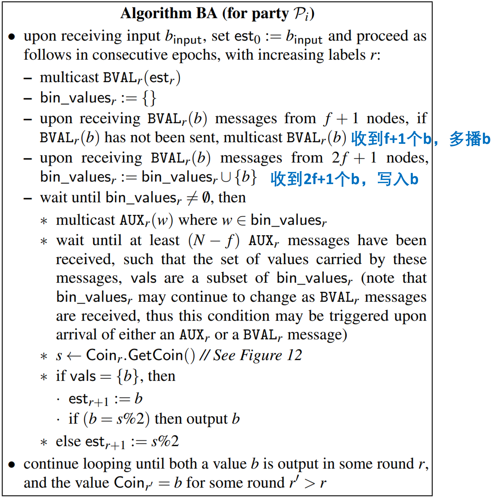

对于BA过程中关于通过0/1比特投票，更形象的表达如下图：

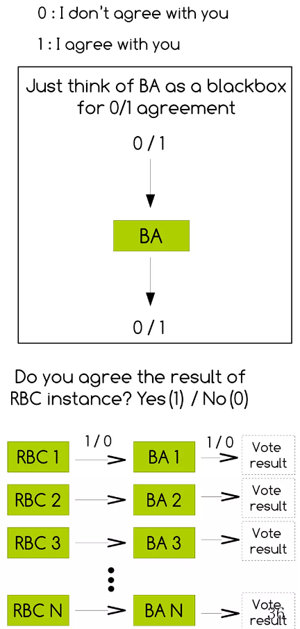

对于每个节点维护的ABA实例，有如下关系

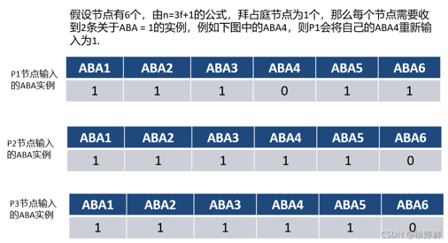

经过共识后得到被共识的二进制列表，将结果为1的交易集提取出来，并使用门限解密密钥进行解密。提取的过程可以形象化表示为下图形式：

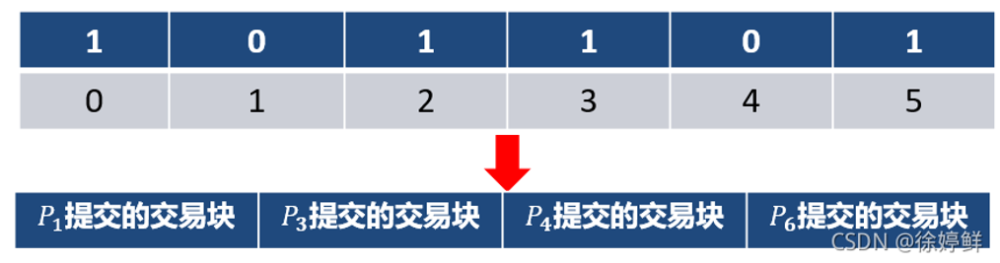

当收到f+1个对同一交易集的解密分片时，就可解密出当前的交易集。后经交易去重、验证正确性后，将最终的交易提交，并在每个节点的交易缓冲池中删除提交成功的交易。

### CC抛硬币算法

BA协议中使用了一个Common Coin算法，这个算法是随机数的来源，可以理解为一个**分布式**的对象，作用是$\textcolor{red}{向每个进程（节点）发送相同的随机序列}$。因为毕竟是不同的节点需要收到相同的随机序列才能一致。原论文中对CC算法的描述如下：

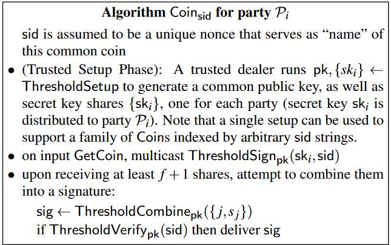

通过CC算法生成对每个节点相同的序列后，每个节点都开始进行BA中的抛硬币，最后达成共识。

## 整体回顾

HBBFT协议设计的非常复杂，以上详细的描述了各阶段的行为和过程，接下来再从整体视角回顾一下该协议各个组件使用的原因及作用。

| 组件/方法/协议名称       | 作用/原因                         | 注                           |
| ------------------------ | --------------------------------- | ---------------------------- |
| 纠删码                   | 平衡节点的带宽限制                | 该技巧也可用于其他共识协议中 |
| BA                       | 确保异步网络中RBC失效后仍顺利进行 |                              |
| 交易池中随机选取批量交易 | 防止交易冗余                      |                              |
| TPKE                     | 防止对手针对性的攻击节点          |                              |

### 第一阶段

每个节点将自己的输入交易广播给其他节点，通过的是RBC可靠广播协议。

### 第二阶段

每个节点参与一个二元共识协议ABA，为每个单独的交易进行投票。

对来自n个不同参与方的n个交易，每个参与方都需要参与n个不同的二元共识协议实例，投票n次。

## 实验结果

### 通信复杂度和Batch的关系

在不考虑拜占庭行为的情况下，通信复杂度和Batch大小的实验结果如下所示：

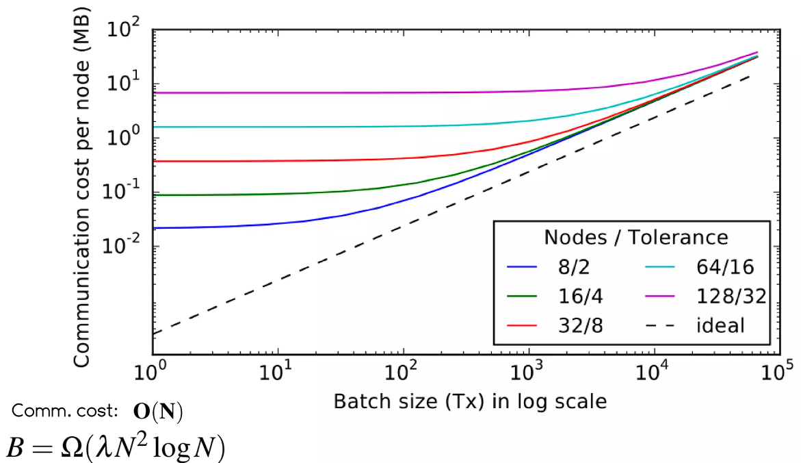

 ### 吞吐量和Batch的关系

在不同批量大小的情况下，不同节点组合的吞吐量结果如下图所示：

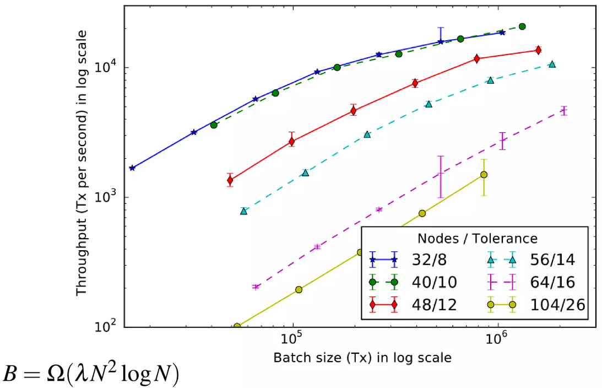

### 延迟和吞吐量

不同吞吐量下，不同节点组对应的延迟结果为：

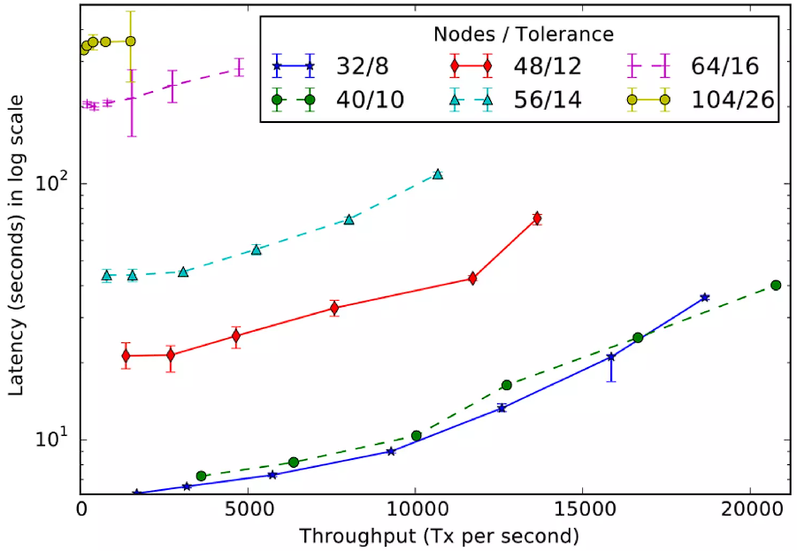

### 与PBFT比较

由于PBFT存在着**领导者瓶颈**[^2]，故在多节点的情况下效果并不好，结果为：

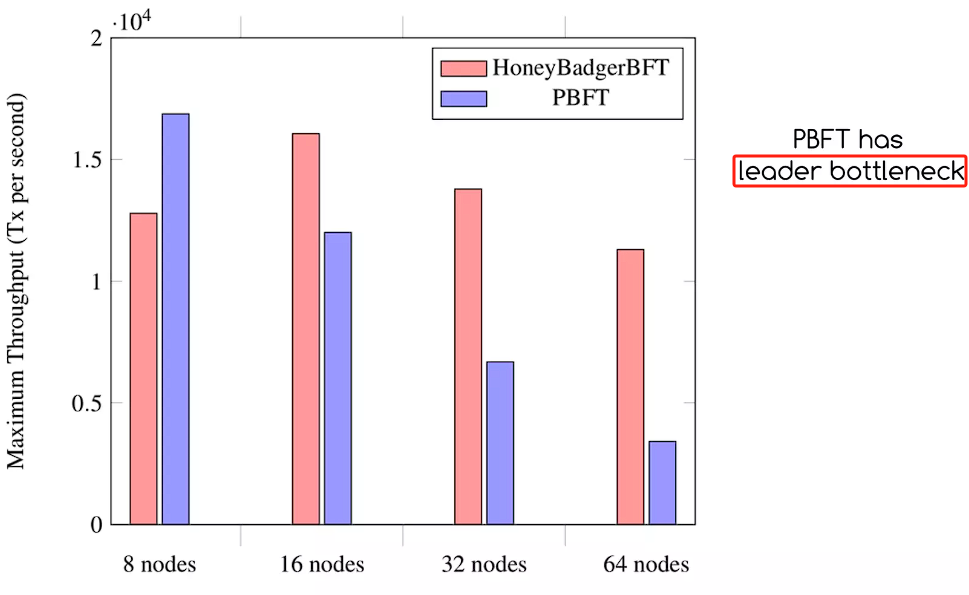

## ADD

### 组件性能

HBBFT的各组件理论性能表现为:

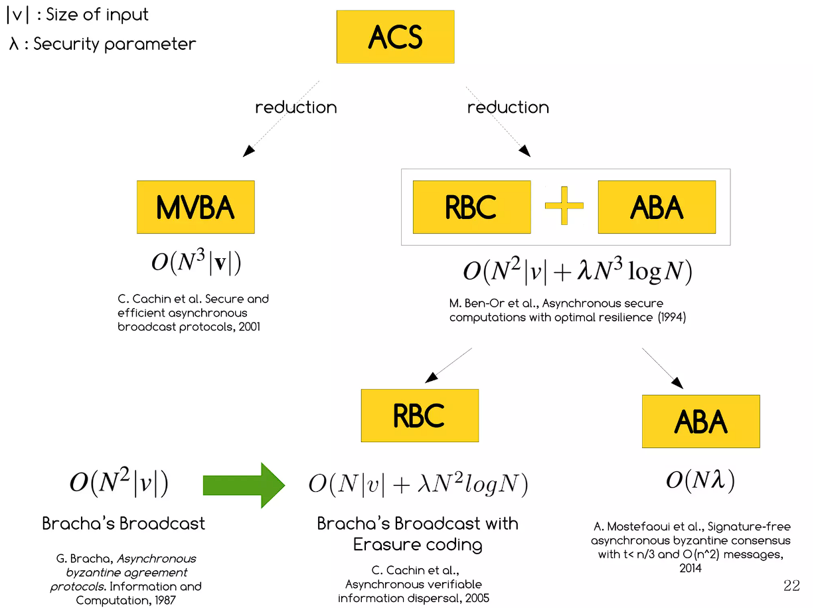

### 为什么这样设计

为什么我们需要RBC和额外的BA?通常情况下，PBFT的可靠广播保证了一致性？

因为在PBFT中，网络有明确的时间限制。但是，在异步网络中，**RBC可能会失效**。因此，为了最终的结果，需要额外的BA，以确保所有正确的过程决定相同的值。

### 后续应用

- HyperLedger Fabric
- 蚂蚁链

## 参考

1. https://www.slideshare.net/YongraeJo/honeybadger-of-bft-protocols
2. https://cloud.tencent.com/developer/news/303989
3. https://blog.csdn.net/qq_37874758/article/details/120522033
4. 知乎

---------------

[^1]:见《分布式系统：概念与设计》
[^2]: PBFT的领导者带宽限制