# Dumbo:Faster Asynchronous BFT Protocol

## 摘要

HoneyBadgerBFT (HB-BFT) 的核心是使用 Ben-Or 等人的异步公共子集协议 (ACS) 实现**批处理**共识，由 n 个可靠广播协议 (RBC) 构成，让每个节点提出其输入，然后是 n异步二进制协议协议 (ABA) 为每个建议值做出决定（n 是节点总数）。

本文提出了两个新的原子广播协议（Dumbo1, Dumbo2），Dumbo1 的 ACS 仅运行小的 **κ**（独立于 n）个 ABA 实例，而 Dumbo2 的 ACS 进一步将其减少为**常量**！我们技术的核心是两个主要观察结果：（1）减少 ABA 实例的数量显着提高了效率； (2) 使用多值验证拜占庭一致性协议（MVBA）在HoneyBFT中被认为对ACS不是最优的，但是如果更加仔细地使用MVBA，实际上可以导致更高效的ACS。

实验结果表明延迟和吞吐量方面，比Honey BFT实现了多倍改进，当系统变得适度大时。

## Intro

BFT的主要场景面对良好的网络连接，故对BFT的研究工作集中在减少加密（计算）上，或者提升参与者门槛从而假设是同步网络。但出于实用性考虑，鲁棒性和效率的原因使我们不得不考虑去除同步假设。

PBFT 在**间歇同步网络**中无法取得任何进展，在这种网络中，对手只会选择在特定时间点延迟消息。 “攻击”可以类似地应用于一类基于领导者的拜占庭容错协议。

使用异步协议在实际构建分布式系统中就大大简化了工程工作，因为不需要设置**超时机制**，而同步协议往往要设置复杂的超时机制。

**原子广播协议ABC就是BFT协议的连续执行**，以维护一个不断增长的日志，就可很容易地构建异步公共子集。Ben等人的ACS协议由两个子协议构建：RBC和ABA，节点通过调用RBC来广播其输入值，并参与ABA协议的n个实例商定输入子集。

由于著名FLP不可能原理，ABA必须是**随机**协议。N个并发ABA会话的预期轮数至少达到了**O(logn)**。但实际的ABA非并发，所有ABA实例的启动时间可能不同且普通节点也面临着大规模并发执行导致的效率下降，实际的复杂度会更高。N变大且网络不稳定时，ABA实例可能会非常慢，而**最慢**的ABA实例决定了HBBFT的ACS运行时间。

实验得出 $\textcolor{red}{ABA的运行时间在ACS中占主导地位}$：

在一个随即节点上统计各阶段的用时，也可以得到ABA耗时很大的结果：

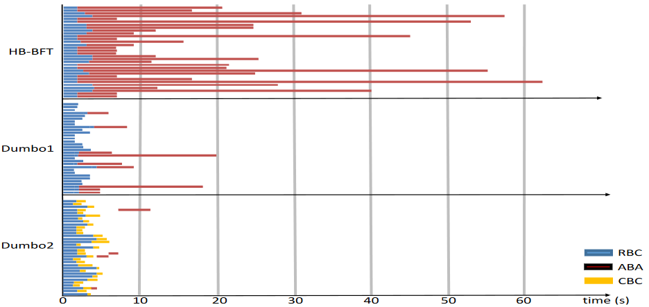

### 本文贡献

设计了两个新的ACS协议，相同环境下运行结果优于HBBFT，并得到两个结论：1.ABA实例的数量应该减少；2.使用MVBA协议在ACS中可能效果更好。

#### Dumbo1

为了减少ABA实例的数量，重新设计了ACS结构，提出了Dumbo1-ACS。该方案只需运行**k**个而非n个ABA实例，并实现了**O(logk)**的运行时间。其他复杂性指标不变。

#### Dumbo2

## 模型构建组件

### 阈值加密

一个**(t,n)**的门限签名方案表示在总共n个节点中，最多t-1个节点可能被破坏。方案包含了以下算法：

|                   算法                   |                             描述                             |
| :--------------------------------------: | :----------------------------------------------------------: |
|   **SigSetup(1^λ^,n,t)**-->{mpk,PK,SK}   | 密钥生成算法，给定安全参数λ，输出特殊的公钥mpk，公钥向量PK={pk1,pk2,......pkn}和密钥向量SK={sk1,sk2,......skn}。 |
|  **SigShare~t~(sk~i~,m)**      -->σ~i~   |    签名算法，输入消息m和自己的密钥时，输出对其的签名σi。     |
|  **ShareVerify~t~(m,(i,σ~i~))** -->0/1   | 共享验证算法，给定消息、索引和签名，验证是否是i节点的有效签名。 |
| **Combine~t~(m,{(i,σ~i~)} ~𝑖∈𝑆~)**-->𝜎/⊥ | 组合算法，具有足够阈值t的一系列的签名时，输出对m的签名𝜎或返回错误。 |
|         **Verify~t~(m,𝜎)**-->0/1         | 签名验证算法，给定消息和签名，验证签名正确性。验证标准为：∀ 𝑚, 𝑆 ⊂ [𝑛] 和 𝑆=\|t\|，**Pr[Verify𝑡 (𝑚, Combine𝑡 (𝑚, {(𝑖, 𝜎𝑖 )}𝑖 ∈𝑆 )) = 1\|∀𝑖 ∈𝑆, ShareVerify𝑡 (𝑚, (𝑖, 𝜎𝑖 )) = 1] = 1** |

### 随机算法

协议中包含一个可信第三方的伪随机数生成器。第三方给每个节点一个私有函数CShare和两个公共函数CShareVerify和CToss。**CToss**在给定**f+1**个经过验证的值后返回一个**唯一伪随机集**（即选定的委员会）。其具有以下性质：

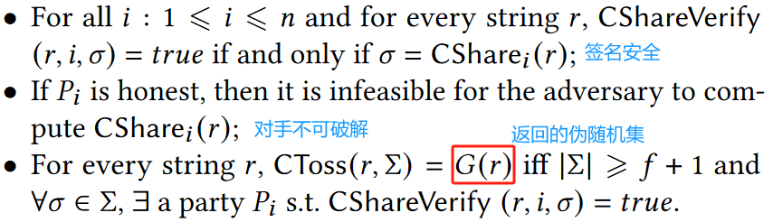

### 委员会选举CE(1,k,e)

此处随机选择k个委员会成员，只需要压倒性的概率保证其中至少一个节点诚实即可，没有一个诚实节点的概率仅为**(1/3)^k^**。实际中，只需要将k设置为**k=min{k0,f+1}**即可，其中**(1/3)^k0^≤e0**，e0为任何想设定的阈值概率。CE算法细节为：

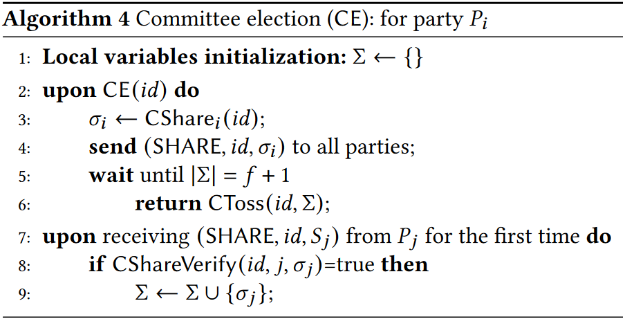

### RBC可靠广播算法

采用了**(n-2f,n)纠删码**和**Merkle树**来减少通信，RBC的消息复杂度为**O(n^2^)**，预期通信复杂度**O(n|m|+λn^2^logn)**。

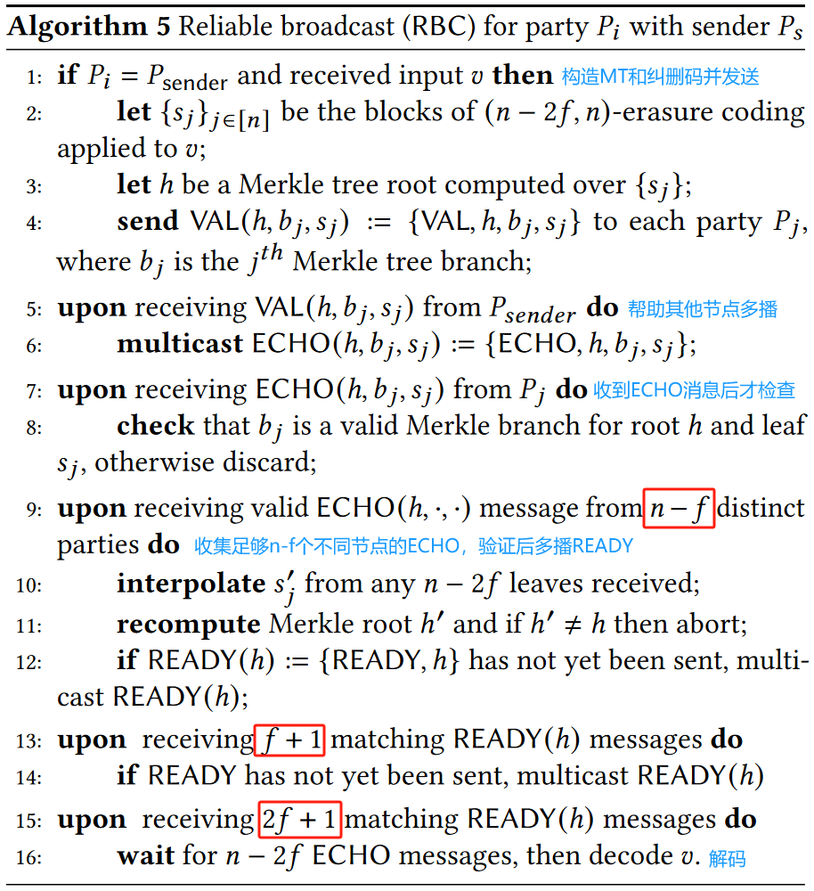

### CBC一致广播算法

CBC是RBC的弱化版，消息复杂度为**O(n)**，通信复杂度为**O(n|m|+λ)**。其算法的详细描述为：

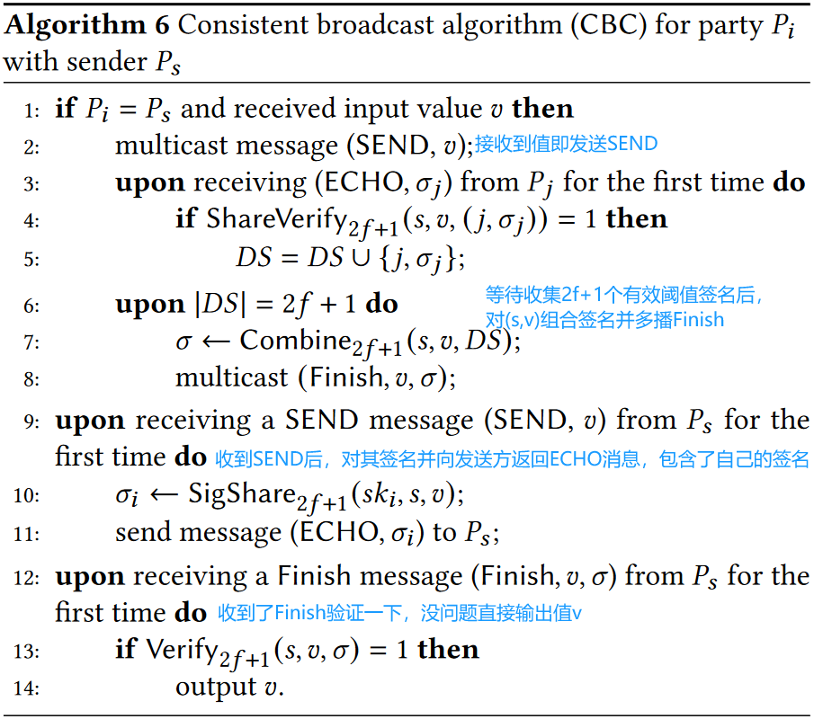

### ABA异步二元协议（待）

异步二进制协议中，每个节点都有一个单比特（0/1）的输入，目标是就已决定的比特达成一致。一个ABA的时间复杂度为**O(1)**，但n个并行的ABA时间复杂度为**O(logn)**。ABA的消息复杂度为**O(n^2^)**，通信复杂度为**O(n^2^λ)**。

Dumbo中，作者还对HBBFT中的ABA做了优化，以加强终止条件和安全性。算法的细节如下图所示。

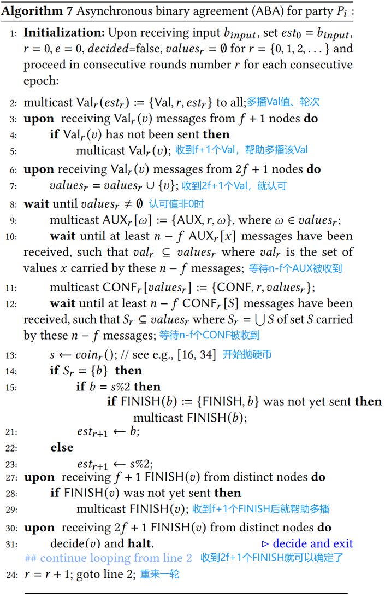

## Dumbo1

### 整体描述

HBBFT需要对每个单独交易执行一个ABA投票，Dumbo1则是降低了ABA的数量以实现更高效的结果。具体来说：广播阶段分为了两类RBC，先是对值的广播，后是对索引的广播。同时不对每个单独的交易投票，而是对每个输入**索引向量**投票。

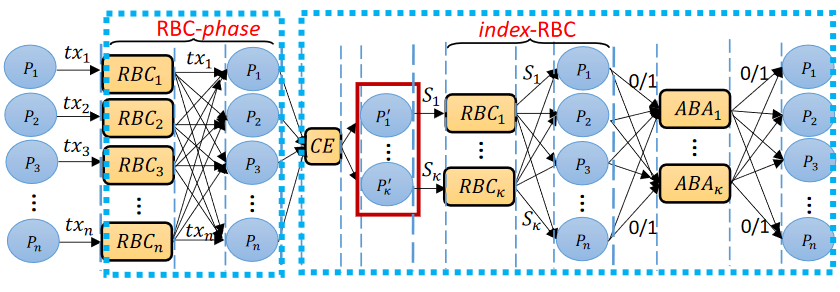

过程为：选出一个包含少数成员的委员会，只要委员会中有一个成员是诚实的。委员会成员再次广播已经收到的元素向量的索引，其他方则是查看自己是否也收到了向量索引集合中的对应全部值，就给对应的ABA投票1。此时的ABA是对每个向量的投票，而非每个节点的ABA。此时的ABA数量也就依赖于了**安全参数k**（其实就是委员会成员数）。

算法的具体描述如下图：

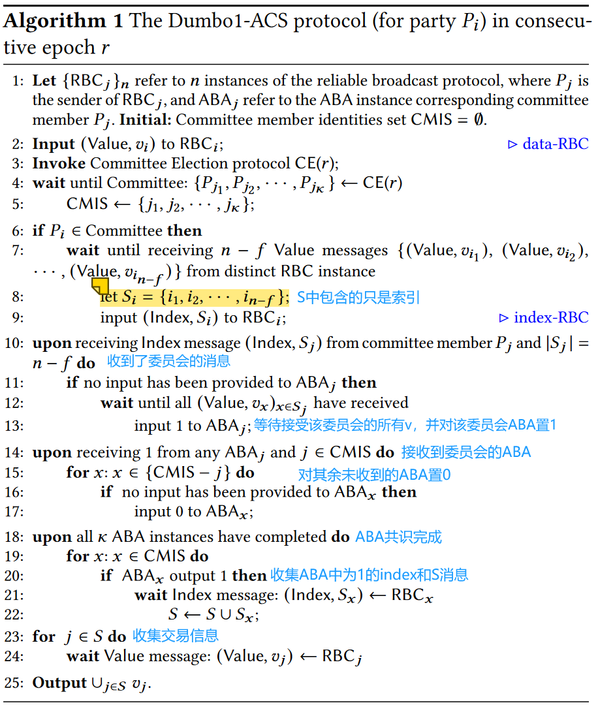

### 分阶段描述

按逻辑划分，算法被分为以下阶段：

#### 值广播阶段

02行，所有节点将收到的值v通过RBC广播出去。

#### 委员会选举CE阶段

03--05行，所有节点参与CE选举，选举出的成员放入CMIS中。

#### 索引广播阶段

06--09行，委员会成员收到**n-f**个不同的RBC消息，组成一个索引向量S，并RBC广播这个索引。

#### ABA阶段

10--17行，诚实节点收到S后，等待收集全部索引包含的值v后，将对应于S的ABA置1。若诚实节点从任意的ABA实例获得了输出（都收到某成员的ABA了，还有委员会的S没有收到或没收集齐对应的值，就不要了），则对其余的ABA实例输入0。

#### 输出阶段

18--25行，当k个ABA终止时，若ABA输出1，则等待对应的RBC索引及值的集合。将所有的值取并集输出。

## Dumbo2

Dumbo2将ABA的数量减少到**恒定**，以保证恒定的运行时间内终止。

Dumbo1中有个问题是：方案设置是每个节点一旦收到来自第 i 个委员会的 Si 以及与 Si 对应的所有值，就会调用/进入第 i 个 ABA 实例。因此**不同的节点可能会进入不同的ABA实例**。没有设置全局协调器的后果就是，只能同时运行所有实例，这样就**浪费了k-1个实例**。

使用**多值可验证拜占庭共识**（Multi-value Validated Byzantine Agreement，MVBA），也就是说，我们能否让每个节点都提议一个子集（前提是这些提议要满足某个前提条件），然后从 N 个子集中**选取 1 个**作为共识结果。其优势就是ABA的数量恒定，且MVBA仅在大尺寸输入直接调用时耗时较大，而当**输入|m|很小**时，MVBA的整体通信复杂度并不大，甚至比HBBFT还要小得多，因此关键挑战已经变成了如何**使用小输入调用MVBA来构建大输入的ACS**，以利用MVBA的ABA数量恒定的优势。

MVBA允许对**任何值**达成一致，而非仅限于二进制值。各方提出一个不同的值，其中包含某些验证信息作为输入，并输出一个决策值。

为了解决上述问题，在MVBA输入时，不直接输入向量而是一个小指示符**Wi**。MVBA输出时也输出一个Wi用来通知每个诚实节点选择相应的RBC。

但MVBA中可能出现诚实节点接到**恶意节点的Wi**，这时就引入了PRBC，是一种增强的RBC，并附带上了简洁证明。该证明通过阈值签名实现证明**至少一个**诚实节点已经收到的了输入（总共f个恶意节点）。

这样，MVBA中的ABA就只需要重复（预期）3次，pai是随机排列即可实现。但由于MVBA非常复杂，在f很小时，Dumbo1可能会由更好的效果。尽管Dumbo2一般比Dumbo1要更快。

Dumbo2有由部分组成：**PRBC**和**MVBA**，其整体架构为下图表示：

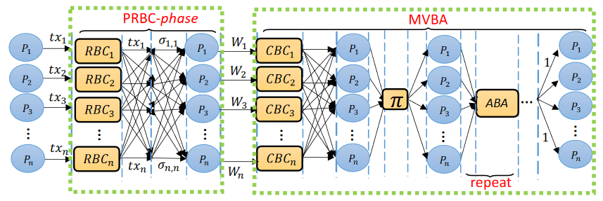

算法的详细描述为：

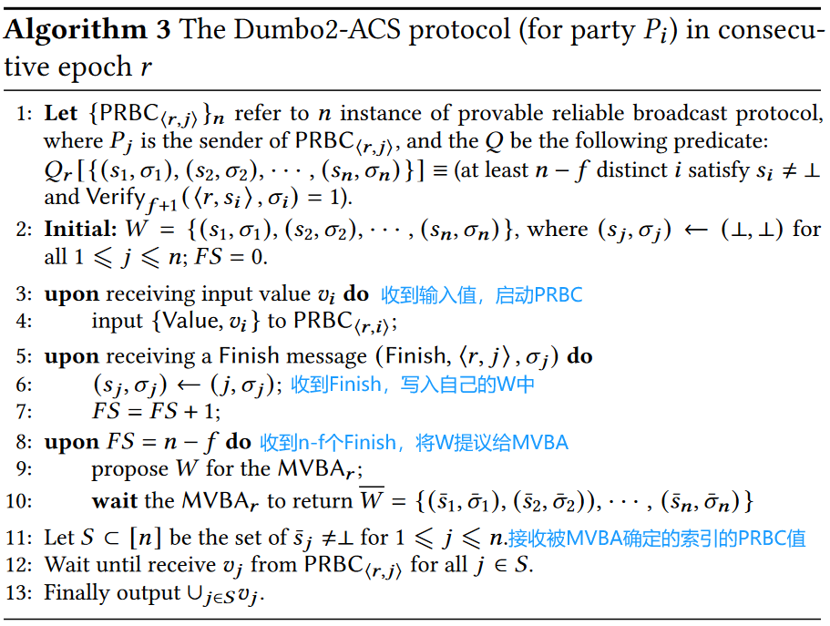

### PRBC可证明的RBC

由于MVBA可能会从不诚实的节点输出索引集，本文提出了可证明的RBC，进一步输出一个简洁的证明，保证所有诚实节点都会收到相同的输入值，从而实现可靠广播。

其中的PRBC算法描述如下图：

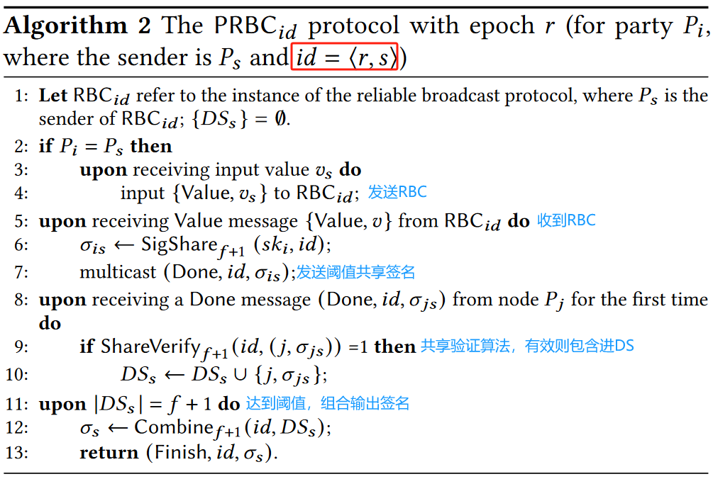

### MVBA

原文并没有给出MVBA的具体设计。

## 效率分析（待）

**m**表示消息大小，**λ**表示阈值签名的大小。得到性能表现的结果如下图，Time表示的是**预期轮数**：

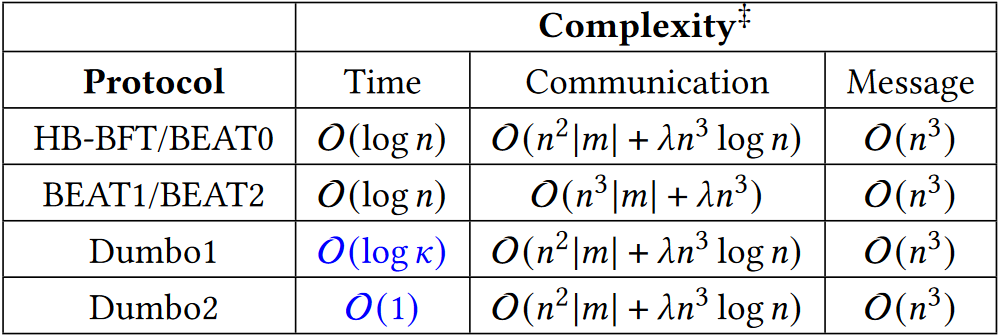

### Dumbo1

消息交换出现在四个部分：1.n个并发的RBC向各方广播输入值；2.委员会选举；3.k个并发RBC广播索引消息；4.各方对k个ABA实例达成共识。

k个ABA实例，其运行时间的期望是**O(logk)**，而RBC是常数个运行轮次。

消息复杂度仍然是**O(n^3^)**，因为添加的RBC实例不超过O(kn^2^)。

通信复杂度，原RBC仍然有**O (𝑛^2^|𝑚| + 𝜆𝑛^3^ log 𝑛)**的比特通信，而新加入的RBC仅有O(𝑛^2^𝜆)，忽略ABA减少的部分，故通信复杂度不变。

### Dumbo2

消息交换出现在两个部分：1.n个并发的PRBC实例；2.一个MVBA实例。

预期时间复杂度仅为**O(1)**，因为n个PRBC总轮数恒定，MVBA运行时间也恒定。

消息复杂度没有减少，因为n个PRBC就产生**O(n^3^)**的消息，MVBA仅有O(n^2^)。

通信复杂度，由PRBC主导，故仍是**O (𝑛^2^|𝑚| + 𝜆𝑛^3^ log 𝑛)**，MVBA阶段仅为O(λn^3^)。

## 实验仿真

### 实验条件

MNT224曲线上实现Boldyreva的门限签名方案，用于随机数生成，抛硬币以及委员会选举。

SS512对称双线性群上实现Baek和Cheng的阈值加密方案。

在全球10个区域的100个Amazon节点上运行，批次大小B取2到2*10^6^个交易，每笔交易250字节并设置n=4f。

### 实验结果

相较于HBBFT，两种Dumbo在延迟和吞吐量方面都有较大的进步：

#### 延迟

不同节点下的各方案延迟趋势为：

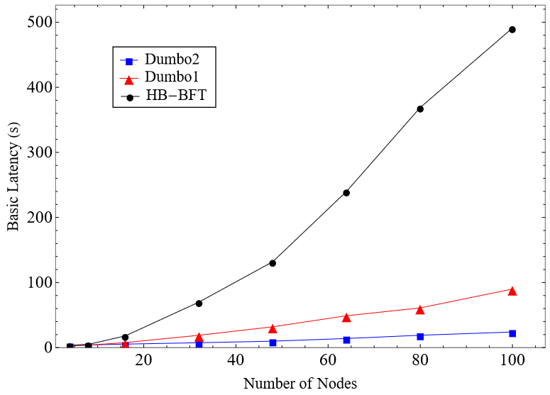

延迟的结果表明了当n变大时，减少ABA的实例数量对延迟改善的显著性。

#### 吞吐量

同时，也得到了不同批大小下，不同节点数量时的吞吐量结果：

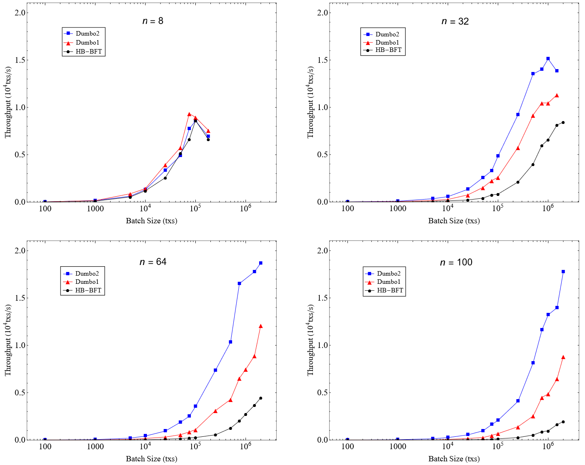

由于带宽和计算资源的限制，吞吐量在某个点会达到**峰值**。一般而言，吞吐量则会随着批大小的变大逐渐升高。同时，当**n变大**时，Dumbo1/2对于HBBFT的吞吐量优势变得越来越显著。

#### 延迟和吞吐量权衡

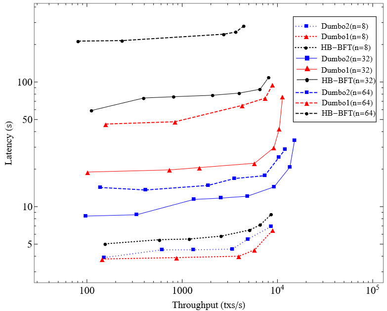

如上图所示，延迟一般随吞吐量的增加而增长，但**增长速度**是逐渐加快的。而横向对比的话可以发现，Dumbo1/2可以 $\textcolor{red}{在相同的延迟成本下提高更高的吞吐量}$，这意味着Dumbo1/2具有更好的扩展性，可以适用于更大的系统。

## ADD

目前多数互联网公司的分布式系统大多是部署的同步共识协议，因为同步共识协议往往具有更好的性能，但也i因此易受到网络攻击。高效的异步共识协议很难设计，因为FLP不可能定理的原因。但近年来有学者尝试引入随机化的算法设计异步共识协议。

### 可研究方向

探索ABA中的进一步优化对实际的影响。

### HBBFT的瓶颈

由于所有异步共识协议都是随机化的协议，故二元共识协议ABA也是随机化的协议。

若并行执行大量随机化协议，协议的终止时间是取决于**最慢**那个ABA实例的。只要有一个慢，整个系统都会慢。

事实上，协议进行的轮数和并发执行的协议实例数量有关。实验结果发现：ABA实例的运行时间占据了绝大部分。本文的优化目标就成了：优化掉上图的蓝色柱子。

### 优化方法Dumbo1

### 优化方法Dumbo2

更进一步，把二元共识协议数量降到最低。

其实最后只需要输出一个向量，只是不知道是哪个，整个协议过程就是在尽量找到要输出哪个向量。

广播阶段结束时，每个节点其实都准备好了一个向量，只是还不知道输出哪个向量。便尝试去使用多值可验证拜占庭MVBA协议。

引入MVBA协议，就需要使所有参与方最终都输出一个相同的向量。这一目标通过**扩展的可靠广播协议**实现，只需要在广播中增加一个证明，以证明有足够数量的诚实参与方收到了交易，如使用门限签名。

但HBBFT认为MVBA是次优的，因为其潜在的通信复杂度很大，因此Dumbo通过特殊处理使MVBA的输入变得非常小。dumbo中的MVBA输入只有索引集合和一个非常简短的证明，这样，协议的通信复杂度不变，但其中的ABA数量被降到了最低。