# Bolt-Dumbo Transformer: Asynchronous Consensus As Fast As the Pipelined BFT

## AB

**乐观异步原子广播**OAABC被提出来以改善慢速异步共识的正常情况性能。如果网络状况保持良好，它们会运行确定性快速通道；如果快速通道出现故障，则可以通过**速度同步机制**（类似于异步证券的视图更改）回退到完全异步协议。但现有的步速同步机制都用到了MVBA，这是一种重型工具，当**波动**的广域网中频繁发生回退时，添加快速通道的好处就不再明显。

本文提出的**BDT**（Bolt-Dumbo Transformer）是一个用于实用乐观异步原子广播的通用框架。并将繁琐的MVBA简化为最简单的**二进制**协议变体。

## INTRO

目前来说，最实用的BFT协议都是针对参与方地理位置接近且联系良好的内部场景研究的。当对手可以任意安排消息传递的顺序时，即**对抗性网络**下，依赖同步的BFT协议会导致致命的漏洞。

### 异步共识协议

$\textcolor{red}{完全异步的共识协议可以同时保证活性和安全性}​$。

由于FLP不可能的限制，所有的异步ABC必须运行**随机**子程序来规避“不可能”，其复杂性不言而喻。直到近年的HoneyBadgerBFT和Dumbo的出现才为实用ABC提供了新的实现思路，为每笔输出交易实现了最佳线性摊销通信成本。

尽管如此，异步共识的实际性能仍比确定性（部分）同步共识（**HotStuff**）差很多，

性能差的原因是什么？还是随机性！各方都会产生一些共同的随机性（如common coin，见HoneyBadgerBFT），并需要**多次重复**才能确保各方同时输出压倒性概率的结果。即使最快Speeding Dumbo平均也需要十几轮后才能共识，但还是远不及HotStuff的5轮和PBFT的3轮。这个问题是设计BFT协议时的一个基本困境：

> 最先进的（部分）**同步确定性**协议乐观地可以非常快地工作，但在对抗性网络中缺乏活性保证；相反，完全异步的随机协议即使在恶意网络中也具有**鲁棒性**，但在正常情况下延迟性能较差。

自然的，作者就想设计一种BFT共识，和确定性BFT共识一样快，而在最坏情况的异步网络中则与现有高性能异步BFT共识相同。**既要，又要！**

### 乐观异步ABC框架BDT

BDT的设计如下图所示:

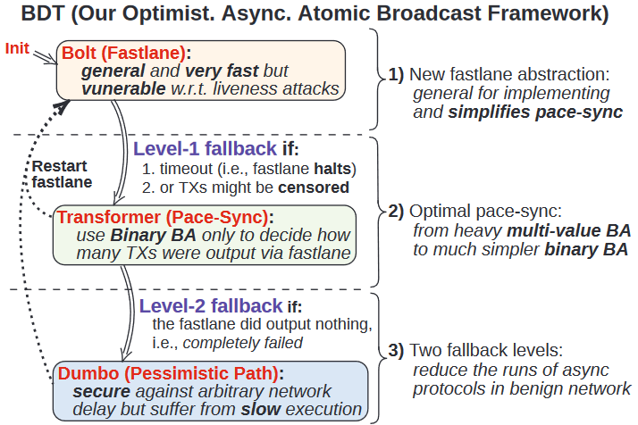

三个部分分别是：

1. Fastlane（**Bolt**）：运行确定性协议的阶段，在同步假设成立的乐观情况下进行。
2. Pace-sync（**Transformer**）：fastlane无法进展时触发该机制，使所有诚实方就何处及如何重启（重启Bolt或进入悲观路径）达成一致。
3. Pessimistic Path（**Dumbo**）：在fastlane无法取得进展时进入，确保即使在最坏的情况下也保持活跃。悲观路径中的协议可以换成**任何ABC协议**。

下图展示了BDT在2秒和120秒的较差网络中的性能表现，并和HotStuff及直接使用Dumbo进行了比较：

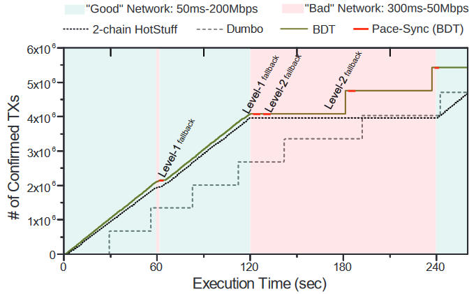

即使在异步网络中，BDT依然可以保持活性和安全性，并有n/3的拜占庭容忍度。同时，它可以和确定性协议一样快，并和异步协议一样鲁棒。

更详细的延迟和吞吐量结果（5大洲16个区域100个服务器）如下图所示：

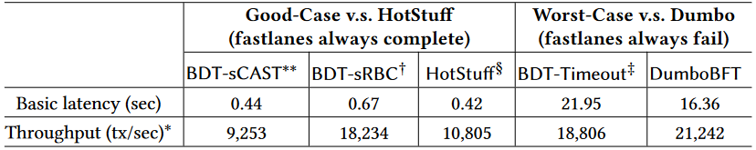

Fastlane中是两种不同的Bolt，Timeout则是模拟DOS攻击下，Fastlane完全无法使用时的情况。

### BDT的贡献

#### nw-ABC

全称为**可公证弱原子广播**，这是一种FastLane的抽象，以更好的应对失败。nw-ABC在乐观情况下实现了ABC，但在悲观情况下仅确保“**可公证性**”。输出块都带有法定人数证明，以证明足够的诚实方已收到先前的块。同时，可公证性确保了任意两个诚实方在进入步速同步时都将位于**相邻块**{s-1,s}，这样就可以用更快的二进制协议取代已有的原子广播或多值协议。

nw-ABC也称Bolt，在乐观情况下可以作为成熟的ABC执行，每个时钟周期输出一个块。若同步假设不成立，就不具有活性，便不会完全一致了，只能确保可公证性。每当任一方在j位置输出带proof的区块时，说明至少**f+1**个诚实方已经存在了**j-1**的块输出，如下图所示：

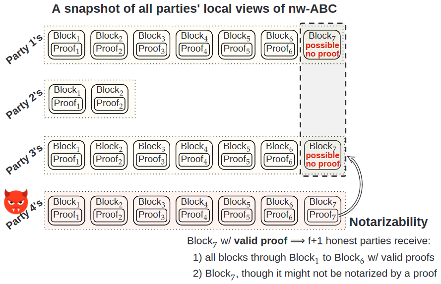

#### tcv-BA

有了nw-ABC，Transformer的pace-sync就可被简化为**二连续值拜占庭协议**(tcv-BA)。其本质还是一个ABBA，但相比之下比利用MVBA实现步速同步，提高了**O(n)**因子。因为ABBA是最简单的异步共识，而pace-sync问题也可以被视为异步共识的一种版本，可以说，这种优化对pace-sync是最优的。

#### 二阶段机制

pace-sync中增加了一个检查，以实现**两级回退**，这是为了更多的使用FastLane。具体来说，检查Fastlane是否仍然存在一些输出（有的话说明还可以用），就会立即重启fastlane，避免进入悲观路径。之前的研究没有加入这种检查，会直接进入悲观路径，这在**短期网络波动**的情况下会大量损失性能。同时，较重的MVBA可能会在频繁回退时抵消掉Fastlane带来的优势。

#### 灵活框架

三个阶段的底层构建模块可以**灵活选择**，并提出了两个示例性的fastlane实例（sCAST和sRBC），可分别用于延迟敏感和吞吐量敏感的场景。此外，Transformer也可以用任何的异步二进制协议来构建。悲观路径也可以被Dumbo外的代替。

## 现有研究瓶颈及本文思路

### 现有研究

KS02实现了开创性工作，RC05的改进则是通过在完全异步原子广播中添加确定性快车道，启动了**乐观**异步原子广播的研究，但依赖大量的MVBA和成熟的状态机复制机制进行回退。效率上很低，具有至少**O(n^3^)**的通信和数十轮次。

$\textcolor{red}{使用低效的步速同步机制会消除引入乐观快速车道锁带来的好处}​$。步速同步机制也是需要考虑其效率的，从下图所示的KS02和RC05在波动网络下的表现就可看出，**一次缓慢回退会导致浪费数十个乐观车道**：

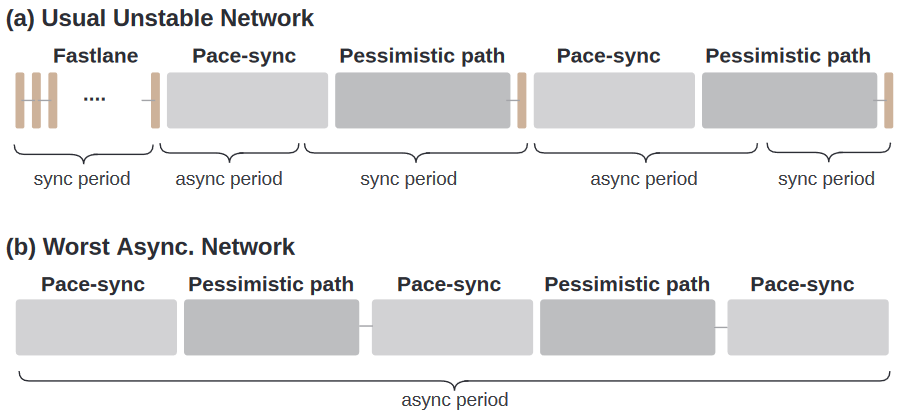

### 本文思路

实际上，本文工作围绕以下展开： $\textcolor{red}{复杂的步速同步问题可以简化为异步二进制协议的变体}$，这样可以通过ABBA构造步速同步机制。如何简化的呢？就是通过构造Fastlane时设计的**可公正的弱原子广播nw-ABC**。 为了防止步速同步后输出不同的块，违反安全性，同时引入了“**安全缓冲区**”。一定意义上，本文中的Bolt就是FastLane同时也是nw-ABC。

## 相关工作

实用异步拜占庭的协议最近才有进展，包括HBBFT、BEAT、Dumbo-BFT、VABA、DAG的异步协议和**DispersedLedger**。

也有同时期的工作在通过最新的MVBA协议，专注于为HotStuff量身定制异步回退协议。但存在两方面的缺点：一是其无法在悲观路径中**保留**每笔交易通信；二是不具备对其他共识协议的通用性。

## BDT的基本组成

### 交易

一笔交易tx表示一串**|m|**比特。

### 区块结构

区块结构如下图所示：

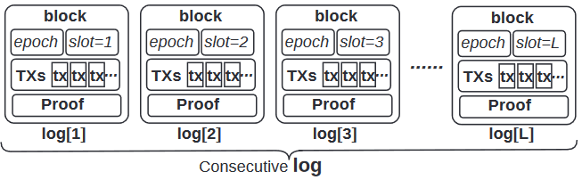

每个区块由**<epoch, slot, TXs, Proof>**组成，TXs是交易序列（有效负载）且论文的批处理大小**B=|TXs|**。Proof作为一个证明，需要至少**f+1**各诚实方的签署投票证明区块有效。

### 威胁模型（略）

### 异步原子广播ABC

ABC中的节点  $\textcolor{red}{每一方都有一个隐式输入事务队列并输出区块日志}$。该协议具有**全序性**、**共识性**、**活性**。

> 协议的属性是很重要的一环，还有上边的威胁模型等。但我不想重复介绍这些细节繁琐的理论知识，这应该是去**精读原文**来学习的。因此，该笔记中只着重观察BDT整体的设计方式。

### 性能指标

**通信复杂度**：每个块包含O(B)大小的事务时产生的所有平均消息位。

**消息复杂度**：各方为生成区块交换的信息数量。

**轮次复杂度**：如名。

### 密码学方法

- 抗碰撞的哈希函数H。
- 阈值签名方案TSIG：(SignShare~t~ , VrfyShare~t~ , Combine~t~ , Vrfy~t~)。
- 阈值加密方法TPKE：(Enc~t~ , DecShare~t~ , Dec~t~)。
- 密码学安全参数λ：签名和哈希的位长度。

### 协议模块

BDT中用到了一些已有的协议，通过黑盒的方式使用如下协议：

| 名称 |                        描述                         |          属性          |
| :--: | :-------------------------------------------------: | :--------------------: |
| RBC  |         指定发送者，将其输入发送给所有各方          | 有效性、共识性、整体性 |
| ABBA |               各方输入输出一个0/1比特               | 有效性、共识性、终止性 |
| ACS  | 每个诚实方输入一个值并输出一组值，符合{f,n}的节点比 | 有效性、共识性、终止性 |

本文中没有对各协议更详细的介绍，直接用于构造BDT框架。

## FastLane和tcv-BA的构造方案

BDT实现简单高效的步速同步需要快速通道抽象（**nw-ABC**）和二进制拜占庭协议的变体（**tcv-BA**）来实现。

**nw-ABC**确保了所有参与方**弱一致**，如果第s块是最新的含足够Proof的区块，则至少f+1各诚实参与方已输出s-1块。此时， $\textcolor{red}{超时后的诚实方要么有块s，要么有块s-1}$。

**tcv-BA**这种BA的变体就是基于上述结论的，用于**在{s-1,s}中决定一个公共值**，尽管恶意方可能输入s-2或s+1。

### 构造Fastlane

#### 可公证的弱原子广播nw-ABC

在id标识的协议中，各方以交易缓冲区作为输入并输出区块日志，每个区块**log[j]**的形式为**<id, j, TXsj, Proofj>**和两个外部函数**Bolt.verify**和**Bolt.extract**。

这是一种不具有精确的一致性和活性的ABC，

#### 比较对象：[11]中的ABSTRACT

[11]中有一种快速通道的组件ABSTRACT则是定义了非常乐观的条件，可以将Fastlane设计的非常**简单**，但代价是无法保证诚实各方的进展。

[11]同时提出了Quorum实现了ABSTRACT，但不满足nw-ABC的公证性，这个很关键。这种弱化使得无法使用二进制协议处理失败的fastlane，因为各方无法将fastlane的失败位置减少到两个连续数字。

#### 通过顺序多播构造Blot（sCAST）

在流水线多播中引入门限签名，就可以构建我们需要Bolt，称为Bolt-sCAST。但需要注意， $\textcolor{red}{Bolt-sCAST导致领导者带宽是其他地方的n倍}​$，除非额外使用内存池，将交易传播与Bolt解耦。

其算法流程如下图：

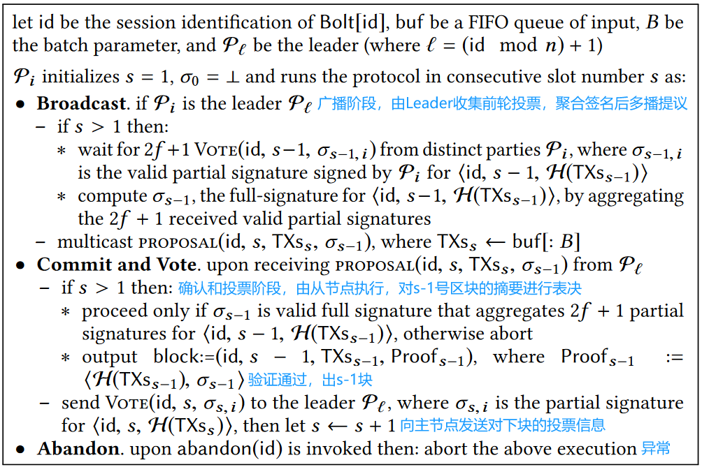

#### 通过顺序可靠广播构造Blot（sRBC）

也可以通过顺序RBC构建Bolt，RBC同时可以使用可验证信息分散技术来提高通信效率并平衡网络工作负载。

其算法流程如下图：

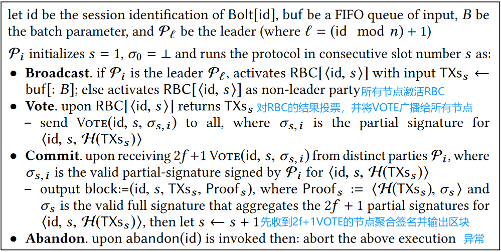

#### Bolt的外部可调用函数

Bolt提供了两个外部可调用函数，供其他过程使用。

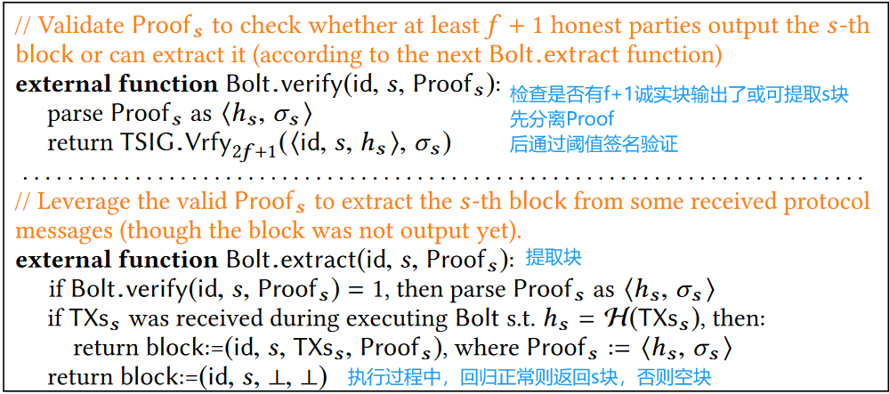

### tcv-BA

二进制协议的变体，帮助诚实各方从两个**未知但连续**的数字中选择一个共识整数。

原始的Dumbo协议中给出的ABA协议的流程如下：

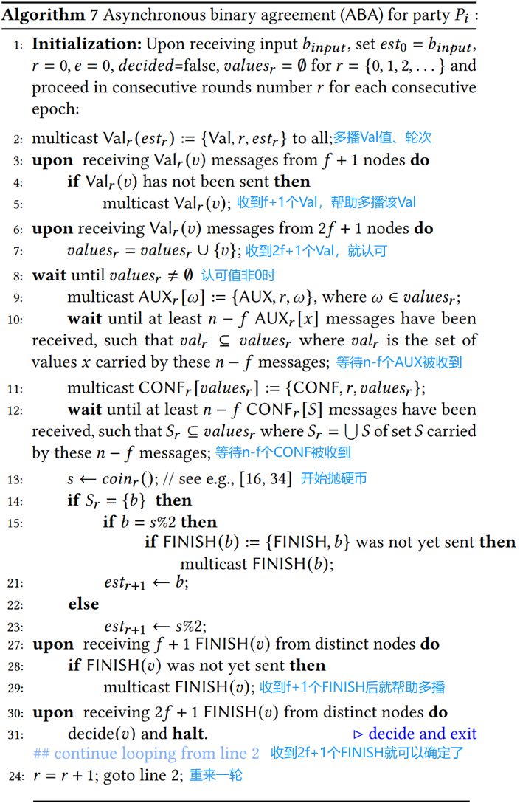

tcv-BA实现了诚实方以压倒性的概率满足终止、一致和有效性。该算法只需要在原Dumbo-ABA的基础上进行如下修改：

## BDT框架

BDT的框架如下图所示：

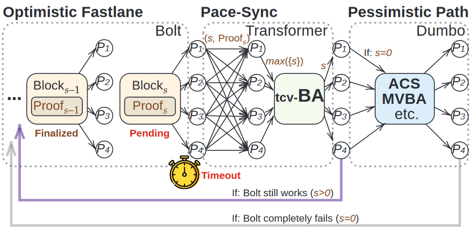

Bolt被包装在每出新块就更新的**计时器**中，超时则多播当前最新块的Proof。各方等待**n-f**个带有效Bolt区块证明的回退请求，并进入Pace-Sync中。各节点使用接收到回退请求中**最大的s**作为tcv-BA的输入，并在tcv-BA中决定出回到Bolt或进入悲观路径。由于tcv-BA无法确保输出**始终**为更大的s，则最新的fastlane块会被标记为Pending，直到返回另一个新块后撤销掉。

## 性能评估

分成了两部分测试，一是稳定的WAN网络下，二是动态网络下。

### 基本延迟

首先考察有效负载为0时（空交易序列）的延迟情况：

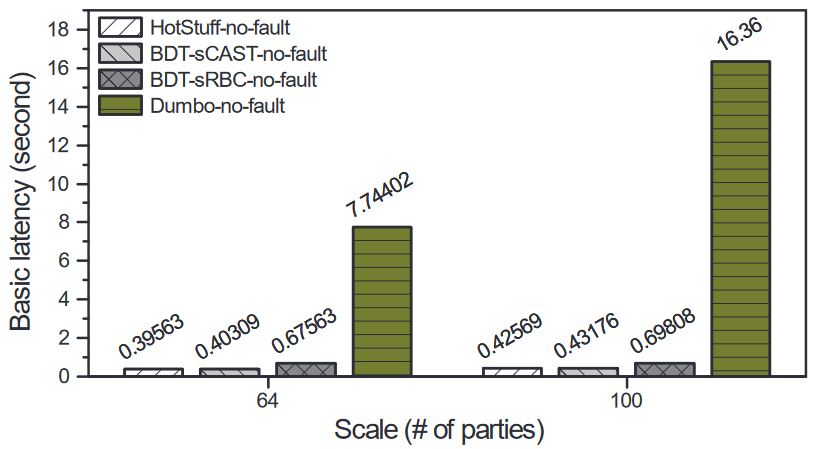

BDT-sCAST的基本延迟可以和HotStuff打平，这是因为BDT-sCAST的快车道可以被认为是**具有稳定领导者的2chain Hotstuff**，且乐观延迟情况下具有五轮，这与HotStuff也相符合。

> BDT-sCAST的**五轮延迟**可以视为：1.领导者多播提议的批次交易；2.各方通过签名的投票；3.领导者多播quorum证明，以允许各方都获得pending块；4.各方接收一个区块；5.各方输出较早的pending块。

### 峰值吞吐量

以每秒交易数为单位测试吞吐量，以观察处理突发事务的能力。若同时使用交易缓冲区，这个值可以更高。吞吐量的结果如下图所示：

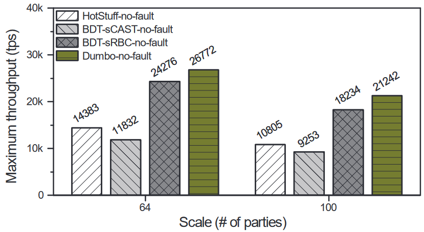

### 转换器延迟

测试了不同的错误情况下、不同方案的步速同步中的转换器延迟，本文的方案明显好于之前研究中使用MVBA回退的结果：

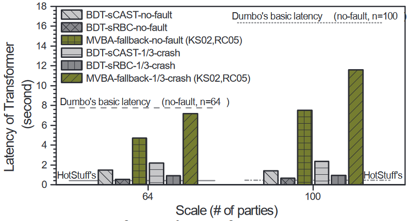

### 悲观路径性能

当BDT遭受DOS攻击时，Fastlane就会持续Timeout，下图展示了这种情况下悲观路径与Dumbo本身的性能差异。BDT比Dumbo总是需要额外花费2.5秒的超时参数，尽管如此，BDT的性能仍然接近于Dumbo：

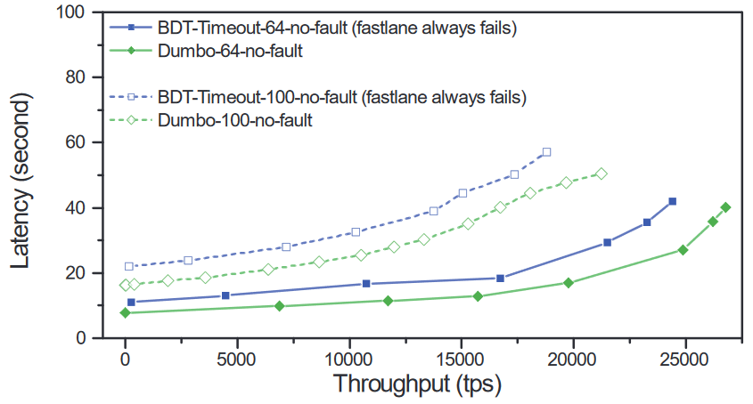

### 整体性能

下图展示了所有的方案吞吐量和延迟情况的关系，BDT-sRBC 是有利于**大吞吐量**的情况的更好选择，而 BDT-sCAST 更适合**延迟敏感**的场景：

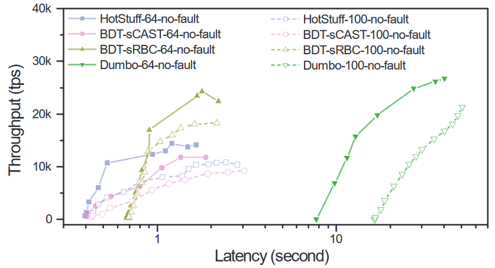

但这种延迟-吞吐量的紧张关系可以在引入内存池后得到缓解。

### 波动网络下的性能

好网络设置为50ms延迟和200Mbps，坏网络设置成300ms和50Mbps。超时设置1s，fastlane区块104笔交易，悲观区块106笔交易，BDT代指BDT-sCAST。

下图展示了两次为时2秒的短时波动下的各方案情况：

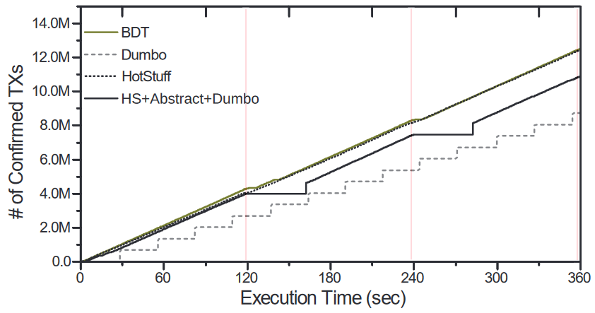

如上图所示： $\textcolor{red}{BDT在短期网络波动下的性能不会显著下降}$，这是因为其独特的**二阶段回退**机制，只需要执行pace-sync阶段就返回快速通道。而对应的之前的研究（由MVBA实现）则会因为短期波动，运行繁重的步速同步和悲观路径。

下图展示了一次为时120秒的长时坏网络下各方案的情况：

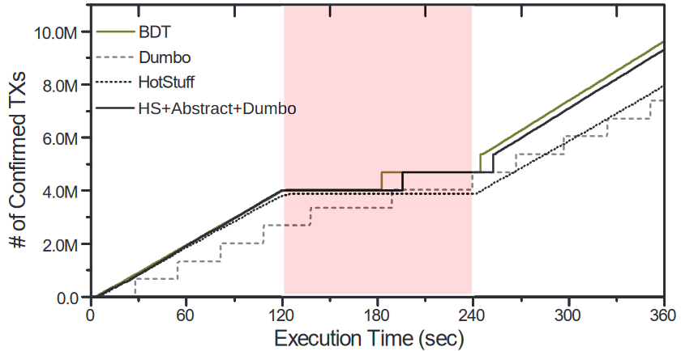

这种情况下，BDT可以实现同样的悲观路径性能，而使用MVBA的回退方案相较之下有着10秒的延迟。这是由于BDT为回退增加了最小限度的开销。

