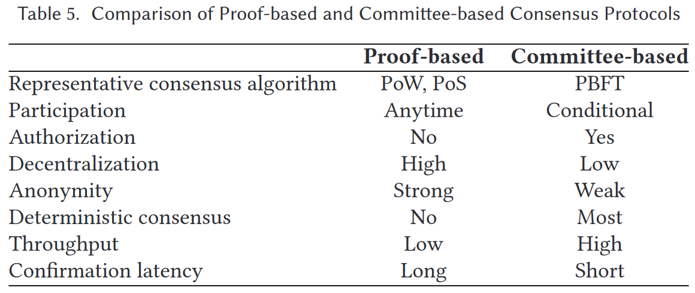
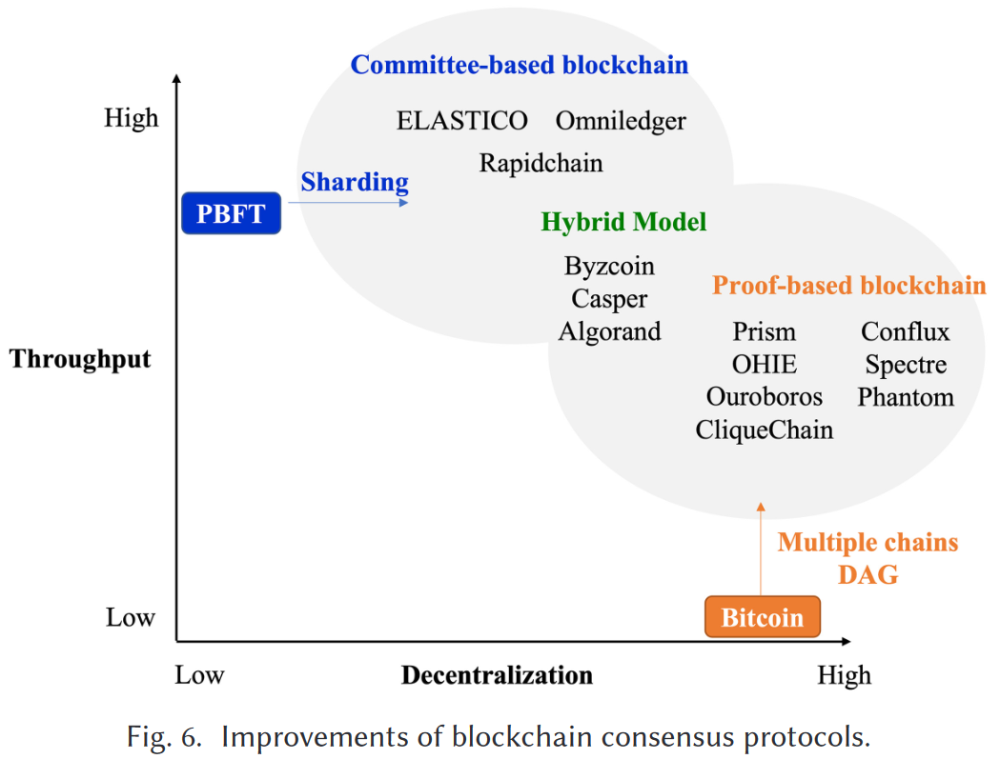
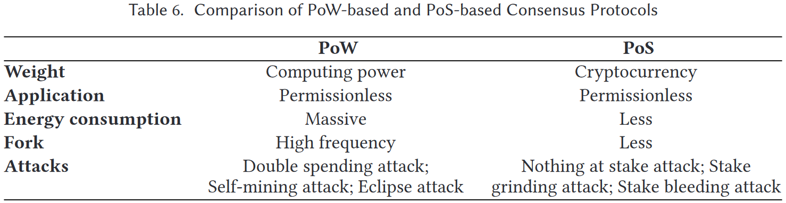

# 共识综述

## 介绍

区块链共识协议的作用就是：**使参与节点能够以相同且唯一的顺序将块附加到区块链中**。

目前提出的共识协议主要解决：

|               解决问题               |                   研究成果                   |
| :----------------------------------: | :------------------------------------------: |
| 提高区块链吞吐量并减少交易的确认延迟 |       Prism、可扩展的区块链协议、OHIE        |
|        避免PoW的大量能源消耗         | Algorand扩展拜占庭协议、Ouroboros、Primecoin |
|             区块链安全性             |      Bobtail、FruitChains、Strongchain       |

### 区块链共识协议的两大设计思路

- **基于证明的共识协议**

模仿了中本聪共识的设计思想，部署在**无许可环境**中对所有节点开放注册，并将新块生成的权利随机分配给参与节点。PoS，PoStorage。

- **基于委员会的共识协议**

遵循了分布式系统中的经典共识算法，如PBFT等。允许参与者**投票**达成共识。委员会往往需要提前知道参与者的**数量**，这种方式更多在**许可环境**中使用。

- **其他共识协议**

结合了两种共识的混合共识、针对特定程序的特定共识等等。

## 区块链的基本组成

### 区块链系统模型

- **数据结构**

|  名称  |                   描述                   |
| :----: | :--------------------------------------: |
|  交易  | 指定发送者、接收者、金额、签名的转账操作 |
|  区块  |    由区块头和区块体组成，各自又可细分    |
| 区块链 |               一系列的区块               |

- **区块链的类型划分**

**无许可区块链**：没有实机/机制**管理参与节点的身份**，完全的开放和去中心化，且往往需要**激励机制**保持系统持续运行。

**许可区块链**：具有一个实体/机制管理许可区块链中参与节点的身份和权限，**授权**后的节点才可追加区块或读取交易。同时比无许可区块链更容易管理和惩罚，且可以脱离激励措施存在。

### 网络模型

共识协议的设计和网络模型的假设密切相关，因为$\textcolor{red}{共识协议的安全性总是基于网络模型而假设的}​$。

- **同步网络**

消息在**固定的上限**内传递，且该上限d已知。因此可以根据d设计按**轮次**进行的协议，保证所有节点在下一个新轮次前都已收到该消息。属于**最简单的、但最难实现**的假设。$\textcolor{green}{底层网络是不可靠的}$。

- **异步网络**

异步网络的消息传递没有固定上限，消息**只能保证最终送达**，但时间不可预测。是最实用的没有时序假设的网络模型，异步区块链的**安全性不依赖于消息的传递时间**。

- **半同步网络**

可以保证固定时间传递，但具体多少未知。即消息传递时间不能作为共识协议设计中的**已知参数**。这种协议更加实用，但**无法抵挡[异步攻击](#异步攻击)**。

## 共识协议的设计原则和标准

### 基于证明的共识协议

步骤为：

1. 矿工验证收到的交易并生成默克尔树，并被打包到新块中。
2. 通过密码学算法随机选举一个节点做领导者，生成新的区块。
3. 节点收到新块后进行验证，将有效的新块加入到自己维持的区块链中。

### 基于委员会的共识协议

步骤为：

1. 提议者向其他参与者多播准备区块的请求。
2. 参与者向提议者回复就绪消息，若提议者收集了足够的就绪消息，就进入预提交阶段。
3. 参与者广播他们的投票来提交提议的区块，若同意提交的响应数量超过阈值，则新区块被加到链中。

### 共识协议的要求

- **安全性**

安全性包含持久性**persistency**和活性**liveness**。持久性指交易在超过**安全参数k**的深度后，该交易就永远存在。活性则是指诚实节点生成的交易总会出现在任何诚实节点的区块链上超过K个区块的深度，即区块链总是朝预期发展。

- **可扩展性**

可扩展性反映了系统规模和工作负载增加时，系统的效率变化情况。包括**交易吞吐量**、**交易确认延迟**。

- **去中心化**

## 比较和讨论

两类共识协议的比较结果如表所示：

理想的共识协议应该实现去中心化和高吞吐量，为此有三条研究的演化路线：

一是DAG或并行链结构代替单链结构实现更好的并发性；

二是在委员会类共识中允许更多节点的加入，如分片；

三是混合共识机制的研究。

下边是PoW和PoS共识的对比

## 潜在研究方向

共识协议的研究潜力主要是共识的**性能**表现。

### 提高交易过程的效率

1. **最大限度减少区块链上的重复/冲突交易，并允许将并发块附加到区块链上**

目前，DAG、并行区块链或是基于分片的区块链，只要允许多块并行追加到区块链时，都会存在**交易冲突或重复**。

如果区块链中不存在重复/冲突的交易，系统有效吞吐量就会显著提高。目前的方案有：利用交易信息$\textcolor{red}{分配交易} ​$或根据交易身份/矿工身份确定$\textcolor{red}{交易优先级} ​$来减少冲突。

2. **提高跨分片交易处理的效率**

目前的做法是将交易随机划分到分片实现负载均衡，但当交易的输入位于不同分片时，所需的**跨分片通信**又增加了高昂的沟通成本。需要更高吞吐量和更低确认延迟的分片算法。

### 基于委员会的BFT协议性能改进

委员会类的BFT协议通过较低的计算成本实现了高吞吐量，但本身是**通信密集型协议**，应用于大规模网络时的高昂**通信成本**限制了可扩展性和去中心化。

1. **降低基于委员会的BFT协议的通信成本**

利用$\textcolor{red}{门限签名}​$、$\textcolor{red}{集体签名}​$等密码算法，避免像Gossip协议all-to-all地发送消息，将复杂度降低到$\textcolor{red}{O(n)}​$甚至更低。

2. **将基于委员会的BFT协议扩展到无许可的环境改进**

基于委员会的BFT共识协议每轮只有部分节点参与共识，其他节点即使拥有海量资源但无法参与共识。若可以有效利用这些闲置资源，就可以提升性能。

### 跨链互操作性

不同区块链在未来可能成为互联网络。对于不同共识、执行不同功能的区块链的互操作性研究也有重要意义。

1. **侧链**

侧链允许多个区块链相互通信，并通过**双向挂钩**执行各种跨链操作。资产安全交换的同时侧链还需保持实现$\textcolor{red}{安全隔离}$，对一条链的攻击不能损害另一条链的安全。如以太坊中有用于互操作的$\textcolor{red}{Beacon链}$，处理不同分片中的链。

## 附录

### 异步攻击

异步攻击是指攻击者利用**网络的异步性**来实施异步攻击，异步攻击的主要特征是攻击者可以选择在不同时间点执行攻击操作，而不必按照协议的同步步骤进行操作，具体有以下几种攻击模式：

|   攻击名称   |                      描述                      |
| :----------: | :--------------------------------------------: |
|   重放攻击   | 攻击者在协议的不同步骤时重放已经捕获的通信消息 |
| 网络延迟攻击 |    利用网络通信延迟，选择性地发送或延迟消息    |
|  重排序攻击  |     攻击者重新排序传输的消息，破坏预期行为     |
|   时序攻击   |             ”旁敲侧击“，欺骗参与方             |

