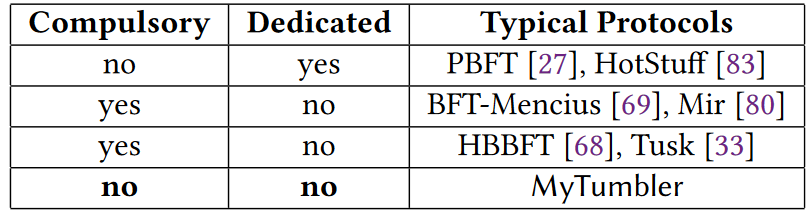
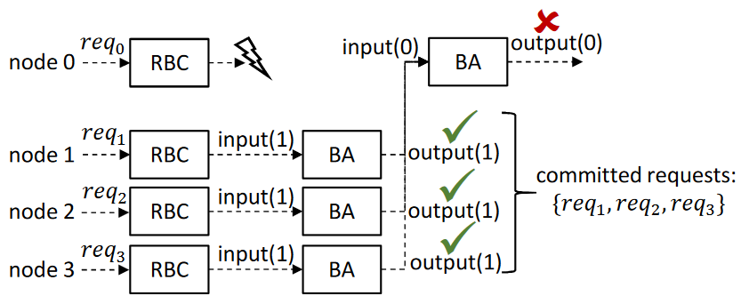
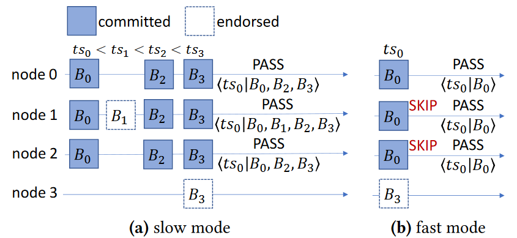
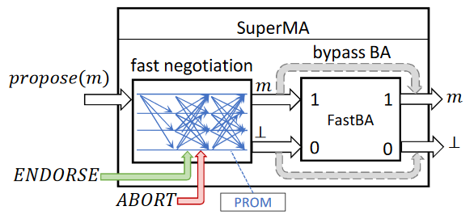

# Flexible Advancement in Asynchronous BFT Consensus

## Abstract

为了实现异步 BFT 协议的适应性，我们提出了一种桥接排序和协议组件的新范例。新范式中的节点可以以更灵活的方式提出和提交块，以适应生产环境中的各种工作负载。为了提高性能，我们提出了 **SuperMA**，一种高效的多值协议协议。 SuperMA 在最佳情况下可以在三个消息延迟内终止，从而实现最佳延迟。我们进一步介绍了 **MyTumbler**，一种基于时间戳的状态机复制协议。 MyTumbler 通过我们的新范例得到增强，并使用 SuperMA 作为其协议组件。在 WAN 云集群上的大规模实验证明了 MyTumbler 对于广泛应用场景的可行性。

## INTRO

BFT共识协议中，基于领导者的协议都是由leader负责**提出客户端请求并对其进行排序**的，是现有区块链系统共识的一个大方向。

但现实是，1.区块链系统多在WAN下部署，网络延迟不可预测；2.节点数量可能成百上千；3.每个节点可能有专门的客户，且不希望将区块生成委托给其他节点。这就需要一个**高效、可扩展且无领导**的共识协议。

部分同步协议是不足以使用的，一是延迟不稳定，二是领导者的性能瓶颈。而异步协议不依赖时序假设，且以**平等**的方式进行。在BKR模式中，每个节点并行提出请求，每个提案要么提交，要么中止，并加入了随机化来规避FLP不可能性。但现在仍面临两个方面的问题：

> 一是负载较轻或不平衡的情况下，即使节点没有提议请求，每个节点都必须参加每个共识实例中的区块提议。（强制参加）
>
> 二是抛硬币阶段被放置在了协议的关键路径上，会大大增加大规模部署中的时间复杂度。（性能限制）

同时，现有的异步协议使用**固定时隙**范例，为每个节点预先分配共识间隙，不仅浪费资源，并且容易引入提案间的竞争。f个节点可能会出现故障，那么异步协议允许n-f个节点快速推动系统前进，但同时也可能会中止慢速节点的提议。一个理想系统应该是这样的：

> 当某一时刻只有少数节点提议时，可以快速前进；
>
> 大多数节点都在提议时，可以适当放慢速度以容纳更多提议；

目前现有共识协议的情况根据是否**给每个节点分配协议槽**（Compulsory）和是否存在**领导者**（Dedicated）可以做以下分类，而MyTumbler对两者都没有要求：

因此本文提出了一种基于时间戳的BFT状态机复制（SMR）协议**MyTumbler**和一种高效的多值协议**SuperMA**。两种方案着手的优化在于：

> 时间戳排序允许每个节点以更精确的方式定位其提案，而不是**竞争**相同的序列号。
>
> 为了实现低延迟，我们观察到，只有当正确的节点对提案有**不同意见**时，才需要达成一致的随机化。

下表展示了两种协议的特点：

| 协议      | 特点                                                         |
| --------- | ------------------------------------------------------------ |
| MyTumbler | 1.每个节点只要有待处理请求就可以提出自己的建议（不同于基于领导者的协议）； 2.每个节点仅在有未决请求时才提议（不同于固定时隙的异步协议）。 |
| SuperMA   | 1.引入**承诺机制**绕过通常的随机化，只需三个通信阶段就可以确定性的终止；  2.正确节点对给定提案有不同看法时，通过抛硬币阶段打破平局。 |

## System Model

### 基本配置

略

### SMR协议

客户端发出请求并将其发送到节点。正确的节点通过批处理收到的请求来生成块提案。一般来说，区块链系统或 SMR 协议旨在通过给予每个提案一个位置来提交每个提案，该位置满足其他已**提交提案位置的线性化**。包括以下两个特性：

> 安全性：如果ESi和ESj分别是任意时刻两个正确节点i和j的历史执行序列，则ESi是ESj的前缀，反之亦然；
>
> 活性：正确节点的请求要被每个正确节点执行；

### 可靠通道

点对点连接，消息最终都会被传递，但是通信是异步的，可能需要任意时间才能传递，且可能无序。

### 物理时钟

每个节点都配置了物理时钟。

## Background and Motivation

在传统 SMR 协议中，每个节点被假定为同等行为并具有**相同**的工作负载和/或容量。实际的应用情况为：

> 工作量不平衡：有电子钱包节点处理来自客户的大量资金转移，银行节点则一般用作处理；
>
> 延迟偏差通常出现在地理分布式部署中；
>
> 轻负载下保持稳定的性能（尤其是客户端感知的延迟）；

下图展示了BKR模式的一般流程，这种BKR的模式是多种异步SMR协议的核心组件，RBC 将多值协议简化为二值协议，而 BA 用于终止。：

## MyTumbler

### SMR协议

SMR协议是实现共识的常用手段。

SMR 协议通过**排序ordering**和**执行executing**新发布的提案来进行。如果正确的节点已就在 φ (B) 处执行 B 达成一致，我们就说提案 B 在位置 φ (B) 处提交。那些提交的提案，在达成一致后，就完全被排序了。位置 φ (B) 可以是**序列号** [27, 68]、DAG 中的**整数或高度** [20, 33] 或**时间戳**（在 MyTumbler 中）。我们说排序组件将每个提案分配给一个位置。

**立即执行已提交的提案并不安全**。当且仅当 B 被提交并且每个提交的且 φ (B') < φ (B) 的 B' 都已被执行时，正确的节点才能安全地执行 B 中的请求。通过不断执行新提交的块，系统（即状态机）不断前进。带来的问题就是：$\textcolor{red}{如何知道之前所有已提交的提案？}$目前的方案都是每个时隙用一个提议填充，尽管空提议会浪费资源。但另一方面，其实各正确节点只需要知道**何时可以安全执行提案**就可以将共识进行下去，而不用提议填充。

### 灵活推进范式

新范例中，我们通过要求每个节点显式“传递”一个位置来抽象正确节点前进的方式。这个想法的灵感来自于**仲裁交集**（为了安全）以及任何仲裁节点必须能够推动系统前进的事实[41]（为了异步下的活跃性）。

#### ARBC可中止的可靠广播

superMA就是ARBC的实例。

### MyTumbler细节

pass机制；

快速模式-跳过消息，不经过ARBC；

当传递时间戳时，每个节点显式广播传递消息。它有两个目的。首先，它承诺节点将不再支持**过时**的提案。其次，它承载了该节点**最近认可**的提案。当一个节点看到 n − f 个节点已经通过了 ts 时，一方面，它可以学习一些它不知道的提案。另一方面，它知道在 ts 之前不能再提交其他提案。因此，节点只需要等待 ts 之前所有待处理的 ARBC 实例终止，然后 ts 之前提交的所有提案就可以顺序执行。注：左图的ts1还未被传递，B1仍有机会被提交。

其算法如图所示：

## SuperMA：高效的ARBC实例化

包括两部分：提出了一种**快速协商子协议**，一方面有RBC的功能（将多值协议减少为二进制协议）；另一方面，可以完全绕过ABA协议并终止ARBC。同时提出了**FastBA**，随机二进制协议，以绕过昂贵的硬币反转，用于打破不同意见的僵局。

### 快速协商

### FastBA

## Conclusion

本文介绍了 MyTumbler 和 SuperMA。 SuperMA 是一种就每个区块提案的内容达成共识的协议协议，而 MyTumbler 是一种基于时间戳的 BFT SMR 协议，通过灵活推进范式增强，它告诉何时可以安全地执行已提交的区块。

我们只利用了基于时间戳的排序方法，尽管可以插入其他方法，例如基于序列和基于 DAG 的排序。作为一种协议协议，SuperMA 可以很容易地在其他异步协议中使用。还可以在CFT模型中应用灵活的推进。