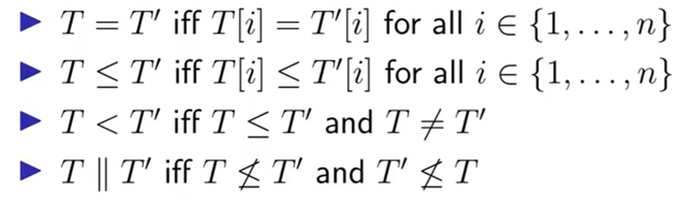
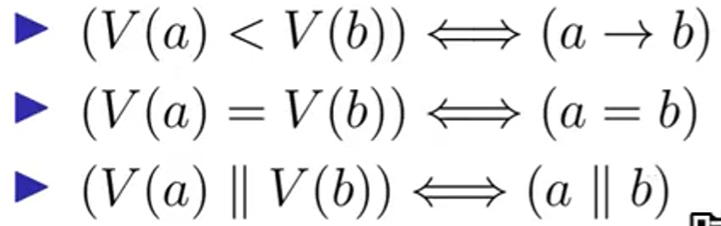

# 分布式系统-剑桥大学

## 2.3系统模型

一个系统模型的假设包括三个部分：网络情况、节点行为、时间假设。

### 网络情况

导致消息丢失的情况有很多种：缓冲区满载、网线断掉等。

在分布式系统中一般认为通信是点对点的，是有一条通信链路的，而这条链路的可靠性又可以被分级。可以分为三种：可靠/完美网络；公平丢失网络；任意网络

网络在进行中又可能出现一个情况：网络分区。

### 节点行为

Crash崩溃停止：节点进程崩溃就死机了。

Crash崩溃恢复：Crash掉了但是有稳态存储器留存崩溃前的信息。

拜占庭行为：恶意节点，不遵循算法流程。

### 时间假设

同步网络：所有行为存在一个时间上界

部分同步网络：折中假设

异步网络：没有任何假设

但是，时间假设不是总是成立的。

## 2.4容错

### 可用性

根据不同个数个9，系统对外提供服务的时间是有区别的，在实践中，有一个对外提供可用服务的时间占比如下表所示：

| 服务提供时间百分比 | 时长            |
| ------------------ | --------------- |
| 99%                | 3.7days/year    |
| 99.9%              | 8.8hours/year   |
| 99.99%             | 53minutes/year  |
| 99.999%            | 5.3minutes/year |

另外，还有指标用于表示可用性：

**Service-Level Objective（SLO）**：99.9%的正确消息回应和200ms的最大延迟。

### 容错

**故障检查器Failure detector**：检查其他节点是否失效的算法。

传统该检查器是通过计时器实现的，但无法区分是消息延迟、丢失或是不回复的情况。

## 4.1逻辑时间

时间戳是可能和我们所期望的事件发生时间不同的，为了更好的表达逻辑因果关系，又引入了逻辑时钟的概念。

> **物理时钟**：随时间流逝计数
>
> **逻辑时钟**：随事件发生计数，我们期望当事件e1发生在事件e2前时，其逻辑时钟的事件T(e1)<T(e2)。

逻辑时钟有两种形式：Lamport时钟和Vector时钟。

### Lamport时钟

Lamport时钟的核心思想是每个节点都有一个计时器，并将事件e和时间 t相关联。节点在发送消息中包含当前的t,接收方会在收到消息后更新自己的**t=max(t,t’)+1**。

在Lamport时钟中，就提出了偏序关系和全序关系。

该时钟也有弊端：第一点就是对于L(a)<L(b)的情况，无法判断两个事件是真的a<b还是a||b并发的，这也是向量时钟的作用。

### 向量时钟Vector clocks

#### 配置

相当于每个节点维持了一个数组（向量），用于存储其他节点的时间戳信息。

#### 向量合并算法

更新时间戳的方法则和Lamport类似，对于节点i而言：

> 发生本地事件，将自己的T[i]+=1；
>
> 想要发送m消息，先更新自己的T[i]+=1，并向其他节点发送自己的(T,m)信息。
>
> 接收收到其他节点的(T‘,m)类型的消息后，将对整个T进行更新。具体做法是：自身的T数组各项均更新为max(T[j],T’[j])。由于是i节点本身发生的事件，并进行T[i]+=1。

这种情况下，各节点的向量关系被定义为：

通过这种定义，就获得了事件发生关系的性质：

