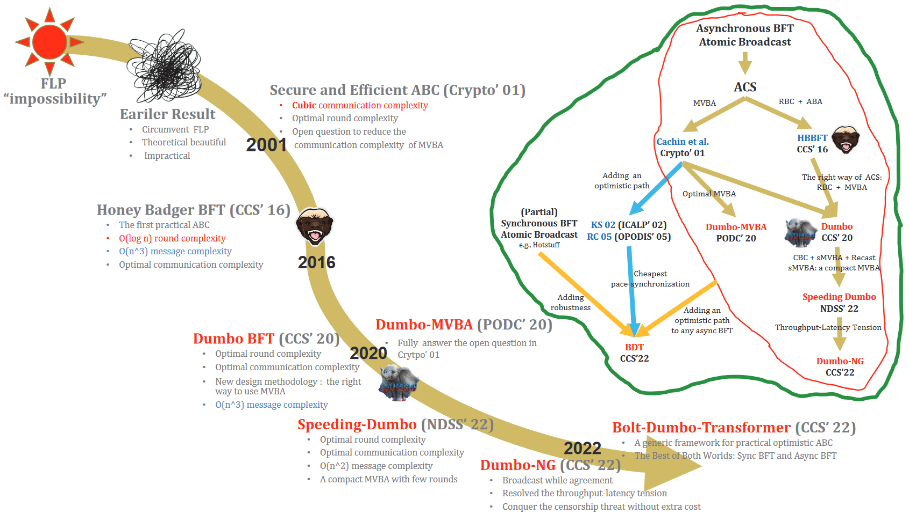
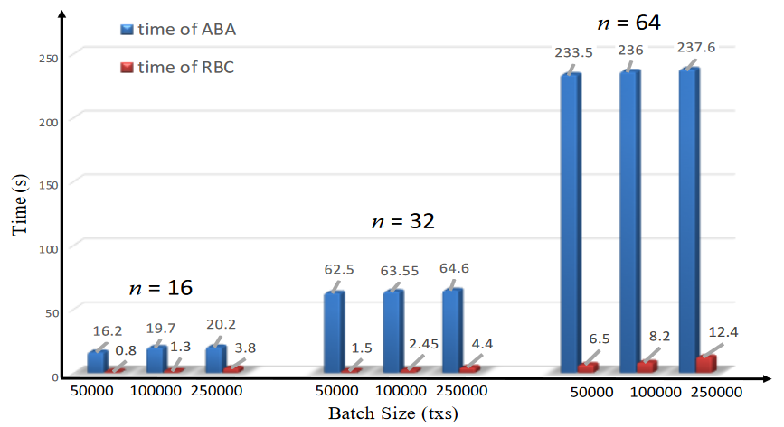

# Towards Optimal and Practical Asynchronous Byzantine Fault Tolerant Protocols

## AB

异步拜占庭共识不依赖任何形式的时序假设。HBBFT的出现，使得该领域的研究走向实践。

Dumbo系列的最新协议结果可以在合理的范围内具有**100K的tps和仅几秒的延迟**。

## INTRO

### 异步拜占庭协议

拜占庭容错（BFT）协议是分布式计算的一个基础研究领域，协议目标是**使一组不受信任的节点能够达成共识，使得分布式系统能够在网络延迟和节点故障的情况下提供正确的服务**。它们提供了强大的安全性和活跃性，因此有潜力实现高可用的网络服务。

在WAN（广域网）环境中，（部分）同步网络的BFT协议已经不适用了，会在网络故障时卡住或崩溃。区块链就是BFT协议的一种应用场景，而且区块链网络是一种**对抗性环境**。因此，异步区块链可以更准确的模拟WAN网络。

异步共识协议的优点比较明显：一是由于不依赖于任何时序假设，**一旦消息被传递，整个过程就会取得进展**；二是**不再需要设计超时机制**，异步协议设计大大简化。

### 研究历史

1980s，Lamport等人提出了拜占庭协议（BA）；

Fischer等人证明了FLP不可能定理：如果一个节点崩溃，在异步设置中就不可能实现**确定性**共识协议；

四十多年来，许多研究设计**随机**异步协议，来规避“不可能”；

2005年的两篇文章指出，$\textcolor{red}{原子广播协议}$（ABC）是分布式系统的关键组件，而任何为原子广播开发的协议**等价**于解决拜占庭共识问题。$\textcolor{red}{原子广播可以看作是BA的连续过程}$。但ABC通信成本过高，性能过差。Ben-Or提出**指数**时间复杂度的异步协议；Canetti和Rabin提出了**多项式**时间的异步拜占庭协议，但消息复杂度激增，成为了工作瓶颈。

2000s，Cachin等人通过**公钥**加密原语实现了多项式时间复杂度的**异步二元拜占庭共识协议**（ABBA）。基于ABBA，又提出了**异步ABC**，但在n个节点的情况下仍有**n^3**^的通信复杂度。

之后，两种新的异步原子广播协议被提出。考虑实际网络延迟的合理性，及乐观阶段工作的时间点。通过一种**步调同步机制**自动将协议转换为悲观阶段。论文[^1]将乐观阶段中的通信复杂度减低到了**O（n^2^）**，而论文[^2]更进一步，降到了**O（n）**。但总体通信复杂度仍高达**n^3^**。由于复杂度的问题，无法适用于大型系统之中。

HBBFT将这项工作推向了实际，其发现**异步原子广播可以通过称为异步公共子集 (ACS) 的较弱变体与阈值加密方案一起轻松构建**。ACS 协议由两个子协议组成：**可靠广播**（RBC）和**异步二进制协议**（ABA）。$\textcolor{red}{ACS协议可以就节点所有输入的子集达成一致}$。且该研究认为通过MVBA构建ACS是低效的，会带来巨大的通信复杂度开销。HBBFT虽然在通信复杂度上到达了最优，但**轮次复杂度从常数增加到了O(logn)**，改进其轮次复杂度就可以提高其性能。

### Dumbo家族演变

#### DumboBFT

确定了HBBFT的主要瓶颈，并通过在ACS中**重新引入MVBA**来减少ABA实例的数量，最终实现恒定的运行时间，从而显着提高性能。

#### Speeding Dumbo

针对DumboBFT中性能较差的两个原因：RBC协议产生的大量成本、MVBA设计的繁重。Speeding Dumbo用更便宜的广播组件取代了RBC，并提出了一种新的MVBA协议：**Speeding MVBA**（sMVBA），比当时的MVBA都更有效。

#### Dumbo-MVBA

将通信复杂度从 O( n2 + λn2 + n3)渐近降低到 **O( n + λn^2^)** （其中 n为参与方数量， 为输入长度，λ为安全参数），这有助于**MVBA在>λn时首次达到最优的通信复杂度**。

#### Dumbo-NG

分析现有协议，主要都是由两个阶段组成：**带宽密集型交易传播阶段**和**带宽放松的协议阶段**。而协议阶段是延迟关键的。Dumbo-NG就是旨在解决这些实际问题的异步原子广播协议。

#### Bolt-Dumbo Transformer（BDT）

在网络条件良好的时候，最先进的随机异步共识的性能仍要比确定性（部分）同步共识差得多。因此，提出了用于**实用乐观异步原子广播的通用框架**BDT。

### 细节

**HBBFT**通过ACS实现了**批处理**共识，由n个RBC构成，每个节点输出其输入，然后由n个ABA对每个提议值做决策。由于FLP不可能定理，ABA必须是**随机**协议。这样的结果是：尽管ABA的预期轮数是固定的，但n个ABA实例的理论轮数至少为**O(logn)**，甚至可能很大。此外，**ABA并非以完全并发的方式进行**，因为网络不稳定时，RBC结束的时间也会有差异。如此看来，HBBFT的运行时间就取决于**最慢**的那个ABA实例。

**Dumbo**因此改进了上述设计，提出了两种新型的ABC协议：Dumbo1和Dumbo2，Dumbo1的ACS仅运行**k**（独立于n）个ABA实例，而Dumbo2的ACS进一步减少到**恒定**。并得出了两个重要结果：（1）较少ABA实例的数量可以显著提高效率；（2）使用MVBA来构建ACS是可以获得更优的结果。

尽管Dumbo使用MVBA代替n个并发的ABA显著提高了性能，但异步BFT的延迟仍相当大。原因有两个：（1）RBC协议产生的大量成本，（2）**MVBA过于繁重**，现有构造需要数十轮，占据了大部分延迟。

**sDumbo**通过使用更便宜的广播组件替换了RBC实例，将消息复杂性降低到最佳。并设计了一个**sMVBA**，将复杂度显著降低。最好的情况下只需要6轮，最坏情况下12轮的MVBA显著优于之前需要几十轮的MVBA。

MVBA是异步网络中ABC的基础，各方以一个值输入，并决定其中一值作为输出，只要决定的输出满足外部有效性条件。MVBA被提出时的**O(ln^2^+λn^2^+n^3^)**的通信是一个大问题，因此即使Cachin等人提出可以将**ACS问题简化为MVBA**，但HBBFT中并没有使用MVBA构建ACS。尽管后来Abraham等人的成果删除了n^3^部分，但由于输入长度l是可能**大于λn**的，此时通信由ln^2^主导，故仍然无法将MVBA用于构建ABC。

**Dumbo-MVBA**中，提出了两种MVBA协议：Dumbo-MVBA和Dumbo-MVBA\*。论文核心是提出了**异步可证明分散广播**（APDB），每个输入可以被分割并分散到每一方，然后以有效的方式恢复。通过APDB和ABA，设计出最优的MVBA协议：Dumbo-MVBA。并提出了一种**通用自引导框架Dumbo-MVBA\***来减少任何现有MVBA协议的通信，以APDB的**小规模证明**作为输入调用底层的MVBA。最后证明了MVBA可以用于构建**高效**的异步原子广播ABC。

目前先进的异步协议往往会为了大吞吐量而牺牲延迟，这是由于目前的异步共识协议主要由两个阶段组成：**带宽密集型交易传播阶段**和**带宽放松型共识阶段**。传播阶段由于交换大量交易，共识阶段不考虑带宽且对延迟影响较大，因为需要交换多轮短消息来决定输出哪些广播。即可以理解为**传播阶段贡献吞吐量，共识阶段阻碍吞吐量**。如果为了高吞吐量放大批次batch，又会导致延迟变差，因为抢占带宽放慢了共识阶段的共识过程。另外还有针对特定节点/交易的审查威胁，故现有设计依赖于更大的通信，昂贵的加密操作，可能无限的内存。如何实现最小延迟、最大吞吐量和审查弹性。

**Dumbo-NG**的核心是将消息广播和共识过程分离。从ABC到**具有质量属性的MVBA**的非平凡直接归约`很复杂的意思`，确保了MVBA的输出以1/2的概率来自于诚实节点。Dumbo-NG解构了**先广播再共识**的范式，使交易广播完全脱离共识，甚至**并发**执行。这样，（1）峰值吞吐量时只有很小的延迟增加；（2）任何诚实节点的输出都可以被同意输出，无需额外成本克服审查威胁。

网络确实有出现问题的可能，但也不是时刻都是有问题的。确定性同步协议在良好的网络条件下可以简单、快速，但当同步假设失败时，会受到拒绝服务（甚至安全漏洞）的影响。相反，异步协议对于对抗性网络具有鲁棒性，但由于随机性的固有使用而变得更加复杂且速度较慢。这是开放互联网环境中设计共识协议的一个基本困境。

**Bolt-Dumbo Transformer**（BDT）是一用于实用乐观异步原子广播的通用框架，实现高效的**步速同步**来处理回退。

### 基于DAG的异步BFT新进展（略）

## Dumbo-MVBA

## Dumbo-NG

## Bolt-Dumbo Transformer

[^1]: Klaus Kursawe and Victor Shoup. Optimistic asynchronous atomic broadcast. In International Colloquium on Automata, Languages, and Programming, pages2 04–215. Springer, 2005.
[^2]:HariGovind V Ramasamy and Christian Cachin. Parsimonious asynchronous byzantinefault-tolerant atomic broadcast. In International Conference On Principles OfDi stributed Systems, pages 88–102. Springer, 2005.